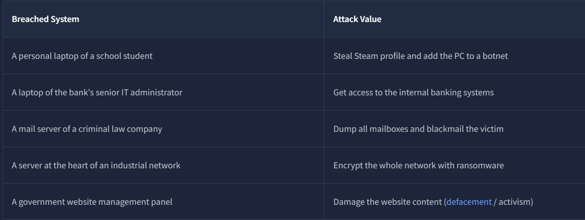
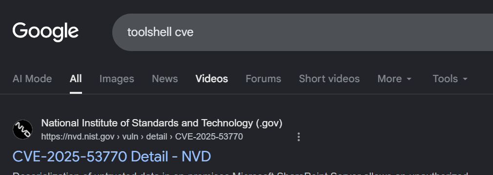
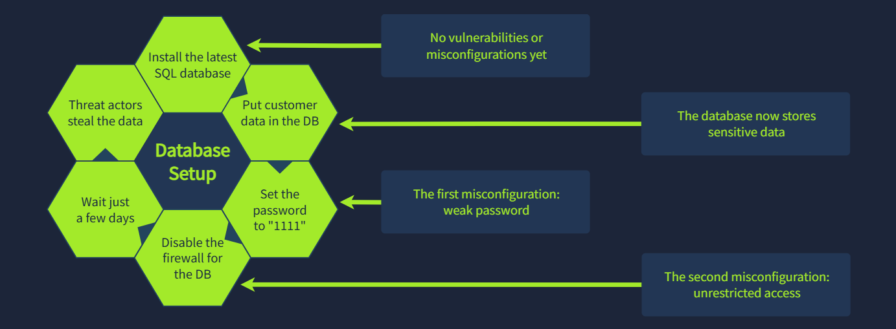
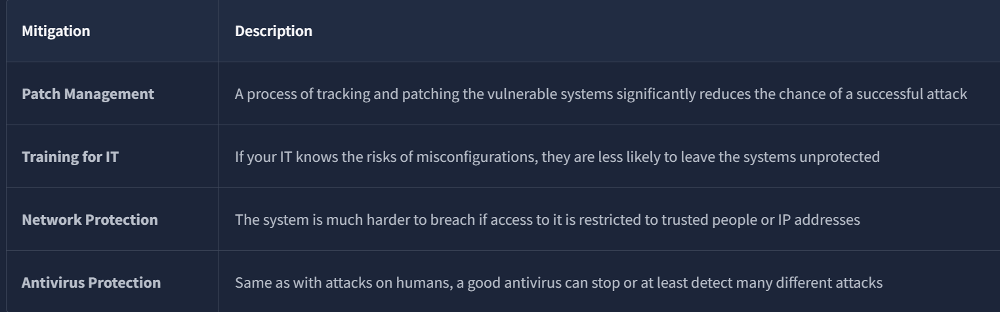
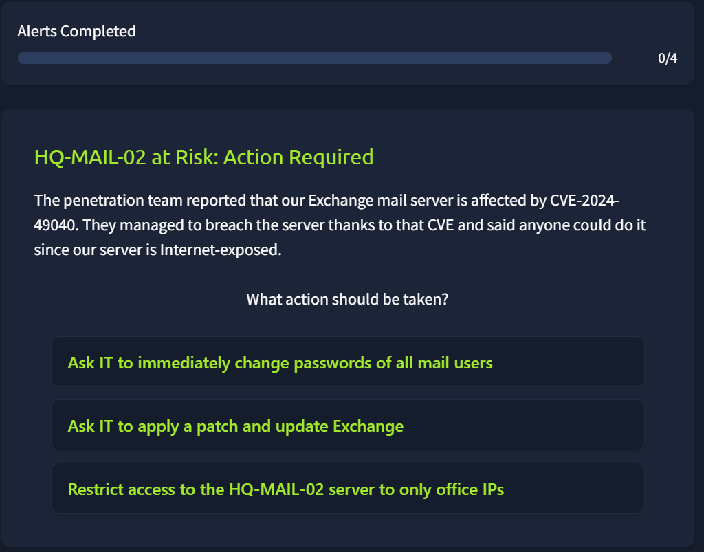
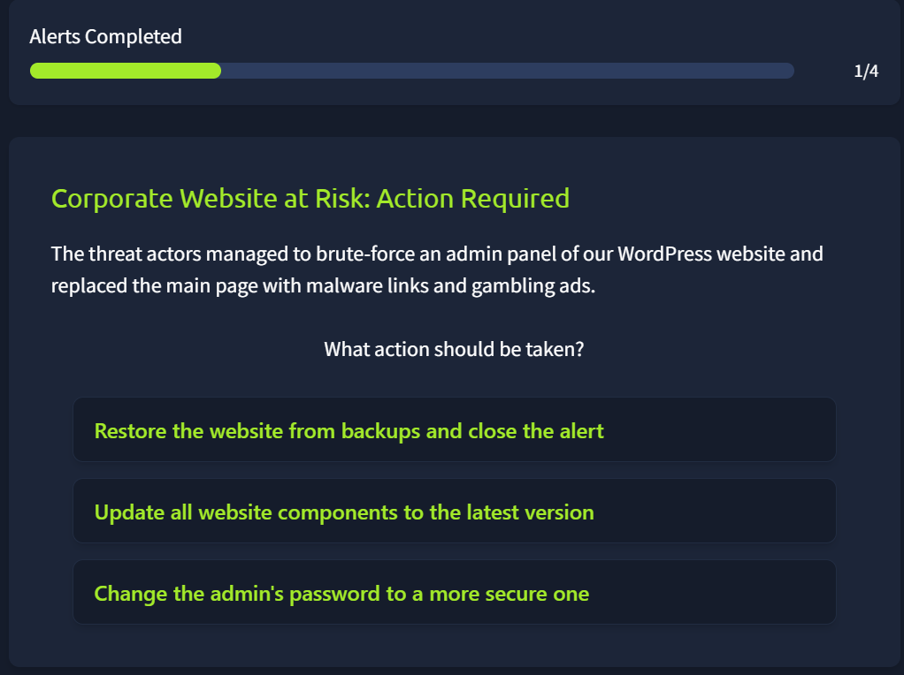
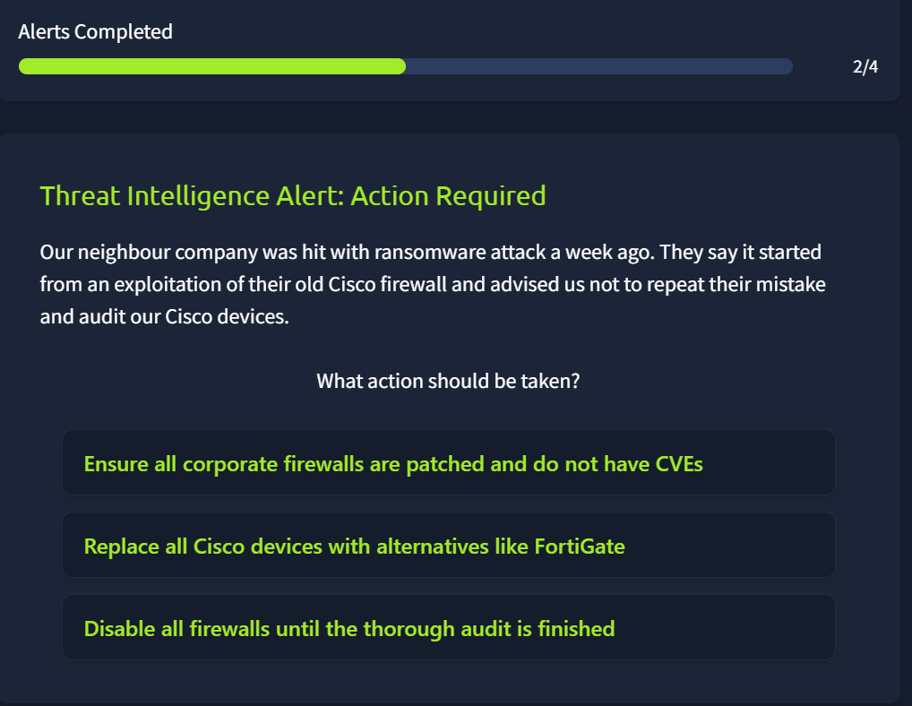
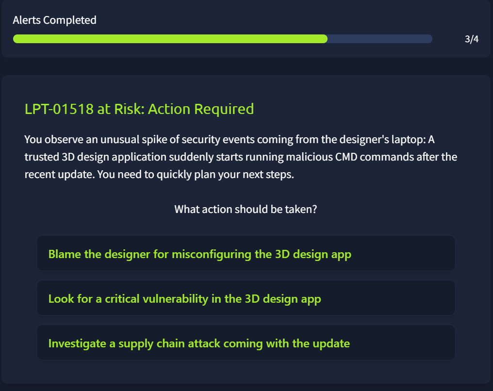
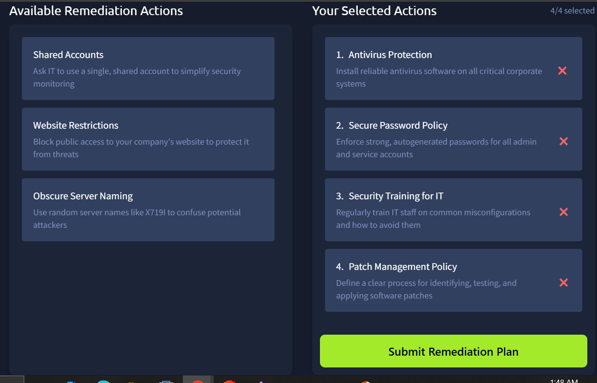

Same idea as the humans room, different attack surface. This one covers how systems get compromised, sometimes without a single person clicking anything, and puts you through four cases where the right fix depends on correctly identifying the failure mode.

# Task 1: Introduction

No question, just framing: understand what a "system" means in this context and how attacks on systems differ from attacks on people.

Prerequisites:
[1- Junior Security Analyst Intro](1-%20Junior%20Security%20Analyst%20Intro.md)
[3- Humans as attack vectors](3-%20Humans%20as%20attack%20vectors.md)

# Task 2: Definitions of System

A system can be a physical server, a virtual machine, or a cloud platform, and a lot of sensitive data (emails, bank details) lives on shared infrastructure like this. That's exactly why a single breached server can compromise thousands of accounts at once, the blast radius isn't limited to one user.

**Can cyber attacks happen without victim intervention (Yea/Nay)?**

Answer

Yea

**Can a breach of just a single system lead to disastrous consequences (Yea/Nay)?**

Answer

Yea

# Task 3: Attacks on systems

Three distinct ways systems get compromised, and each needs a different response:

1. **Human-led** — malicious USB, malware from a pirated site, weak passwords. The entry point is still a person's decision, even though the target is a system.
2. **Vulnerabilities** — flaws in the software itself. If an attacker finds one before the vendor does, that's a zero-day. Once it's public, it gets a CVE number, and it becomes a race, defenders patching against attackers building exploits off the same disclosure.
3. **Supply chain** — the software you trust pulls in libraries you never personally audited. If one of those gets compromised and pushes a malicious update, everything downstream that trusted it is compromised too, without anyone on your side doing anything wrong.

**What is the term for a security flaw that can be exploited to breach a system?**

Answer

Vulnerability

**What is the name of the attack when malware comes from a trusted app or library?**

Answer

Supply chain

# Task 4: Vulnerabilities

Every piece of software has vulnerabilities somewhere, it's a matter of when and who finds them first. A CVE number gets assigned once a vulnerability goes public, and a patch is the actual fix for it.

**What is the CVE for the critical SharePoint vulnerability dubbed "ToolShell"?**

Answer

CVE-2025-53770

**How would you respond to a detected vulnerability on your system?**

Answer

patch

# Task 5: Misconfigurations

A **misconfiguration** is a setup mistake, not a code flaw, which means a patch can't touch it. The only real fix is reconfiguring the system correctly. Penetration testing is the authorized version of an attack, specifically aimed at surfacing these before a real attacker does.

**Can a system patch or software update fix the misconfigurations (Yea/Nay)?**

Answer

Nay (Better setup is only required to fix misconfiguration)

**Which activity involves an authorized cyber attack to detect the misconfigurations?**

Answer

Penetration testing

# Task 6: Practice

You can't train the system but train your IT department

### Systems at Risk

**Case 1 — A system is now exposed.** → Patch and update to close whatever vulnerability caused the exposure.

**Case 2 — Root cause traces to a weak admin password.** This is a human-led systems attack, not a code-level flaw, so patching wouldn't touch the actual problem. → Change the admin password first, before anything else.

**Case 3 — Need to confirm no backdoors remain.** → Patch and confirm no known CVEs are present, the priority is ruling out persistent access left behind.

**Case 4 — Compromise traced to a trusted, already-installed app.** When the compromise comes through something already trusted rather than something newly installed, supply chain is the more likely explanation over a standalone bug in the app itself. → Treat it as a supply chain attack.

Flag

THM{patch_or_reconfigure?}

### Remediation Plan

Four pillars cover the actual ground here: antivirus protection, a secure password policy, ongoing security awareness training, and patch management. Antivirus and password policy handle baseline hygiene, training keeps people from reintroducing risk that tooling can't catch on its own, and patch management is what keeps known CVEs from sitting open long enough to get weaponized.

The reason training and patch management get paired specifically: misconfigurations tend to creep back in through human error even after a system's been hardened once, so this isn't a one-time fix, it's a maintained one.

**Q: What flag did you receive after completing the "Remediation Plan" challenge?**

Flag

THM{best_systems_defender!}

## Detection Note

Case 4 is the one worth flagging for a real SOC pipeline: supply chain compromises are hard to catch with standard vulnerability scanning, because the software itself doesn't get flagged as vulnerable, it's the update mechanism that's compromised. Catching this in practice usually means watching for unexpected outbound behavior after an update lands, not just scanning the binary against known-bad signatures.

## Lessons Learned

The CVE-to-patch pipeline handles vulnerabilities, but it does nothing for misconfigurations or supply chain compromises, which means "we're patched" is not the same claim as "we're secure." Case 2 and Case 4 make the same point from opposite directions: the fix has to match the actual failure mode, credential, setup, or trust relationship, not just default to "patch it" every time.