This is the first hands-on room in SOC Team Internals. It moves past theory and puts you in front of an actual simulated SOC dashboard, five live alerts, and asks you to triage them the way an L1 would on shift.

# Task 1: Introduction

No question here, just setup. Worth noting the room links to the [SOC Simulator](https://tryhackme.com/soc-sim) and the [SAL1 certification](https://tryhackme.com/certification/security-analyst-level-1/details), so this room is explicitly building toward both.

# Task 2: Events and Alerts
The chain runs event → log → SIEM/EDR → alert. Something happens on a system (an event), the system records it (a log), that log gets shipped to a security platform, and if it matches a detection rule, the platform raises an alert. Not every log becomes an alert, and not every alert is a real threat, that gap is exactly what triage exists to close.

Alert Management System:
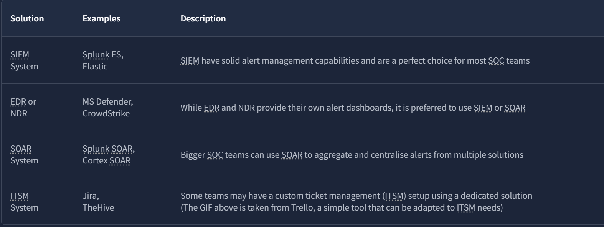

The people around this pipeline each own a different slice of it: L1 reviews alerts and sorts real from false positive, L2 does the deeper analysis on whatever L1 forwards, SOC Engineers make sure alerts actually carry enough context to triage in the first place, and the SOC Manager tracks triage speed and quality so nothing real slips through.

**What is the number of alerts you see in the [SOC dashboard (opens in new tab)](https://static-labs.tryhackme.cloud/apps/socl1-alerttriage/)?**

Answer

5 (2 are closed)

**What is the name of the most recent alert you see?**

Answer

Double-Extension File Creation

# Task 3: Alert Properties

Every alert carries the same core fields, and knowing what each one actually tells you is what separates fast triage from guessing:
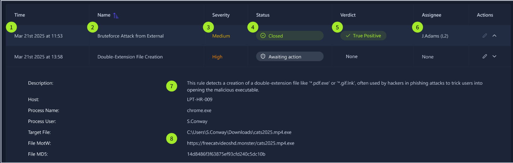

1. **Alert time** → Creation time
2. **Alert name** → Summary of what happened based on the detection rule
3. **Alert severity** → Defines the urgency of the alert
4. **Alert status** → Indicates whether someone is already working on it
5. **Alert verdict** → Shows the analyst's conclusion
6. **Alert assignee** → Identifies who owns the alert
7. **Description** → Explains what the alert is about
8. **Fields** → SOC analyst's comments

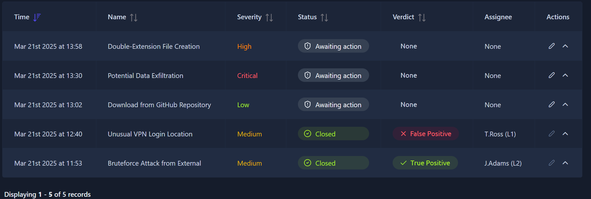

**What was the verdict for the "Unusual VPN Login Location" alert?**

Answer

False Positive

**What user was mentioned in the "Unusual VPN Login Location" alert?**
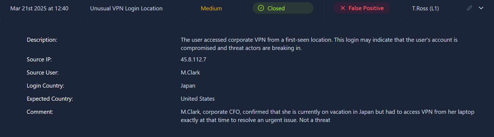

Answer

M.Clark

# Task 4: Alert Prioritization

Three rules decide what you pick up first, in this order: don't touch anything already assigned, sort by severity (critical, then high, then medium, then low), and within the same severity, take the oldest one first. The severity order exists because detection rules are tuned so critical alerts are the ones most likely to actually be real and damaging, not just arbitrary labeling.

**Should you first prioritize medium over low severity alerts? (Yea/Nay)**

Answer
Yea

**Should you first take the newest alerts and then the older ones? (Yea/Nay)**

Answer
Nay

**Assign yourself to the first-priority alert and change its status to In Progress.**  
**The name of your selected alert will be the answer to the question.**
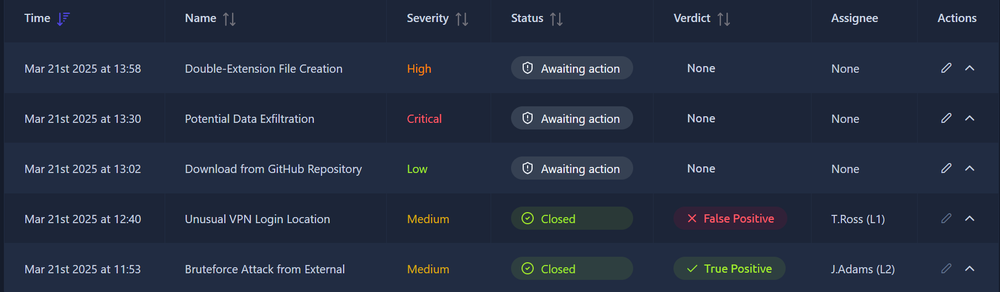

Answer
Potential Data Exfiltration (the only unassigned critical alert)

# Task 5: Alert Triage
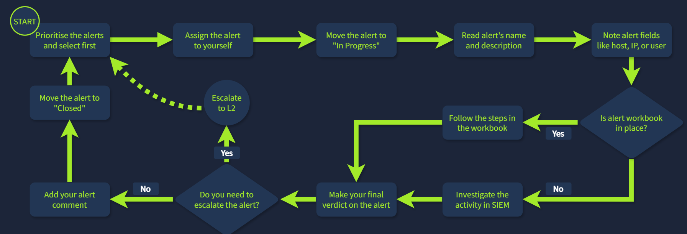
The actual triage loop, five steps: prioritize and assign to yourself, read the name/description and note the important fields, check if a workbook covers this alert type and follow it if so, otherwise investigate manually in the SIEM, then decide close or escalate to L2, and finally close with a comment explaining the call.

**Which flag did you receive after you correctly triaged the first-priority alert?**
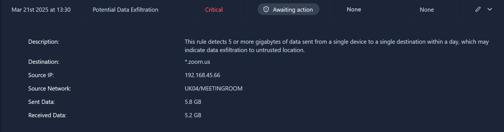
**First-priority alert (critical) — Potential Data Exfiltration.** The large outbound data transfer traced back to `zoom.us`, a legitimate domain. Combined with the fact that this coincided with an online meeting, the large transfer is explained by normal video call bandwidth, not exfiltration. → Verdict: False Positive. Status: Closed, with a comment explaining the Zoom meeting context.
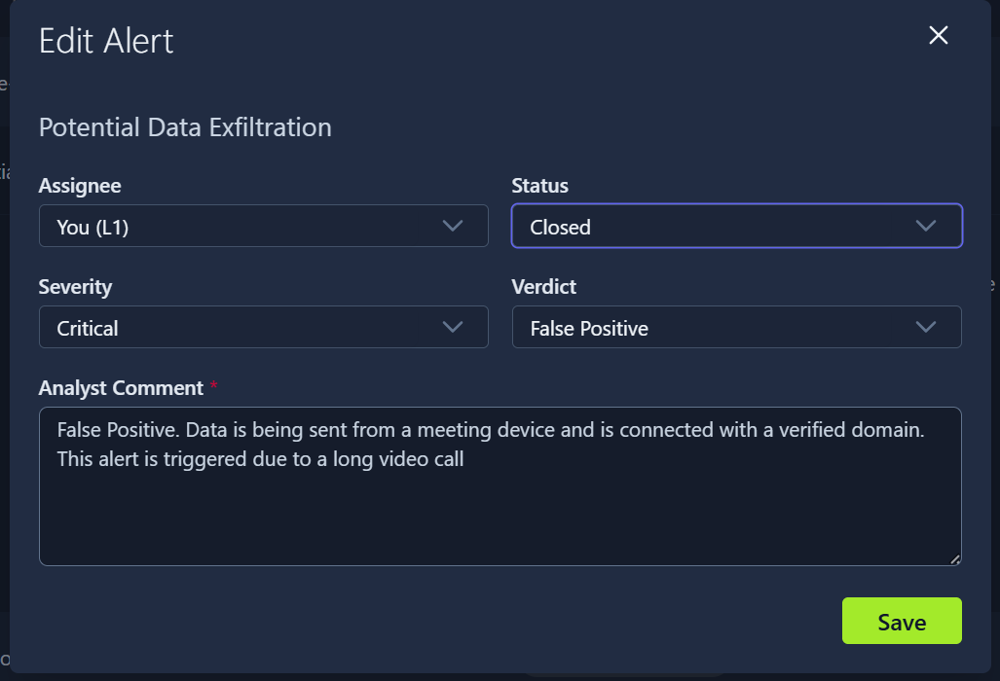

Answer
THM{looks_like_lots_of_zoom_meetings}

**Which flag did you receive after you correctly triaged the second-priority alert?**
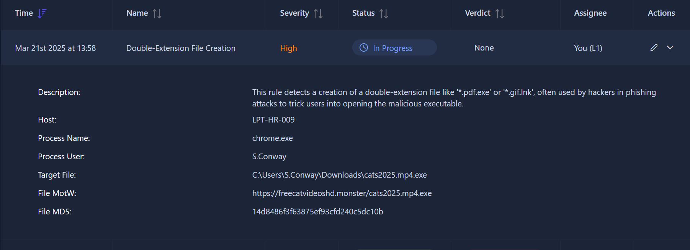
**Second-priority alert (high) — Double-Extension File Creation.** This is the same alert from Task 2, now confirmed as the second pick because it's High severity, even though it's also the newest, severity beats recency in the prioritization order. The file itself came from a questionable domain and carried a double extension, a classic technique to disguise an executable as something harmless like a PDF or image. → Verdict: True Positive, real malware.
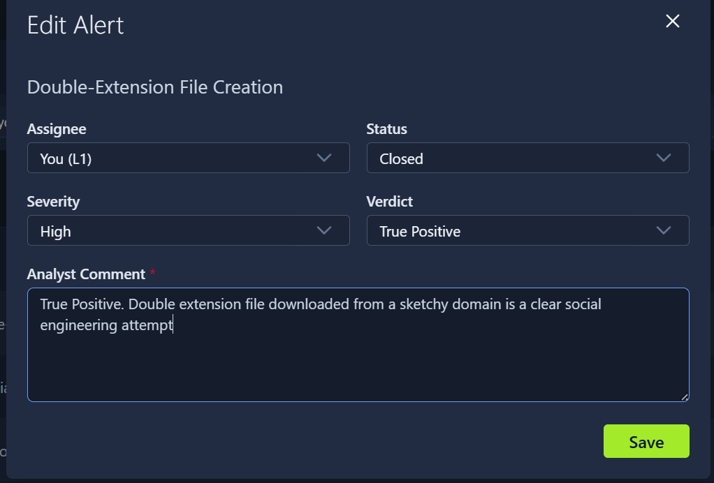

Answer
THM{how_could_this_user_fall_for_it?}

**Which flag did you receive after you correctly triaged the third-priority alert?**
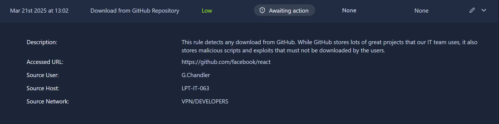
**Third-priority alert (low) — GitHub library download.** A user downloaded a well-reputed, open-source library from GitHub. Nothing here indicates malicious intent, a known-good source and a legitimate package. → Verdict: False Positive.
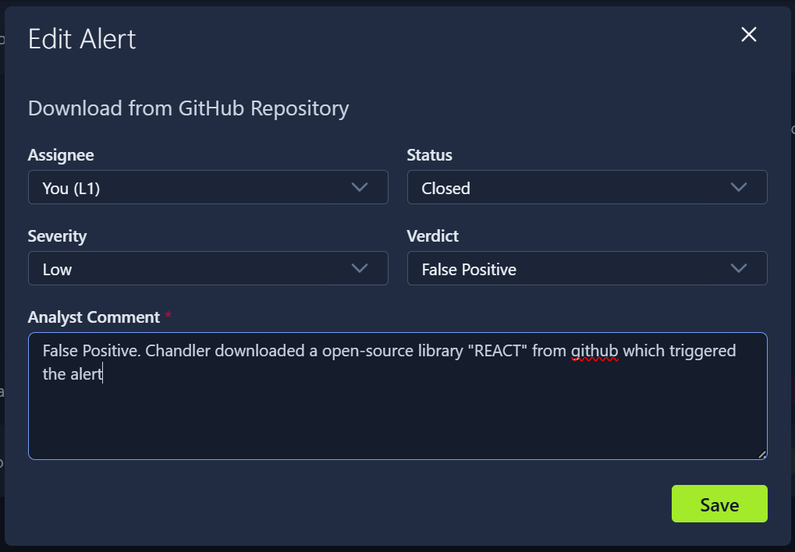

Answer
THM{should_we_allow_github_for_devs?}

## Detection / Defense Note

The pattern across all three cases here is that severity alone never tells the full story, domain reputation and file naming conventions do. `zoom.us` being a real Zoom domain kills the exfiltration read instantly, and a double file extension is a strong enough single indicator to flip a "maybe" into a confirmed True Positive without needing a sandbox detonation first. A detection pipeline that flags double-extension file creation as a standalone high-confidence rule, rather than waiting for a hash match, catches this class of attack earlier.

# Lessons Learned

Severity tells you what order to work alerts in, it doesn't tell you the verdict, that only comes from checking the actual indicators (domain legitimacy, file extension patterns, source reputation). Also worth internalizing: "the newest alert" and "the highest priority alert" are frequently not the same alert, and prioritizing by recency instead of severity is exactly the mistake the room is testing for in Task 4.