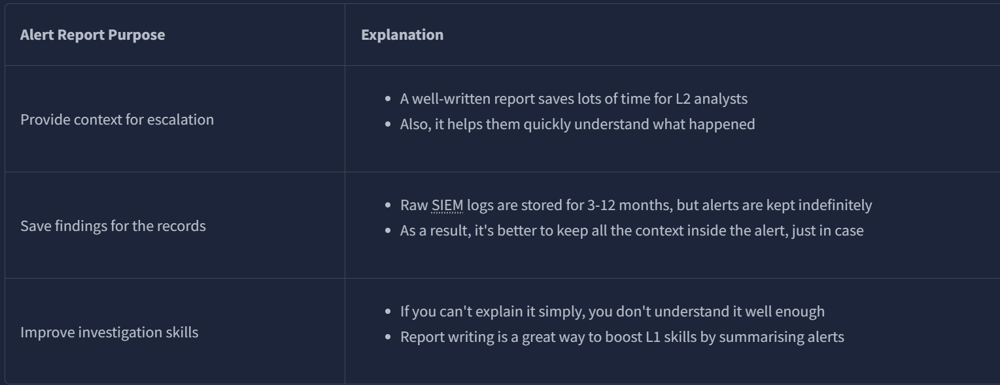
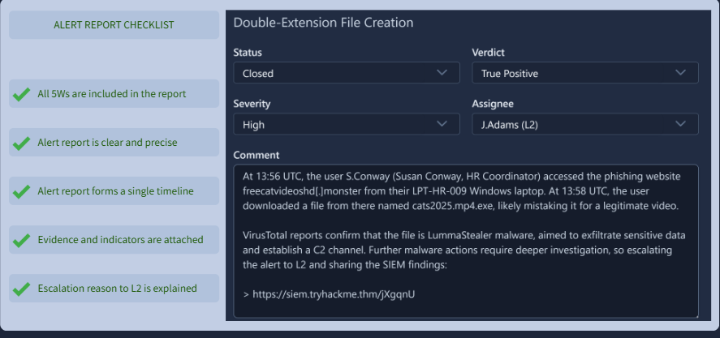
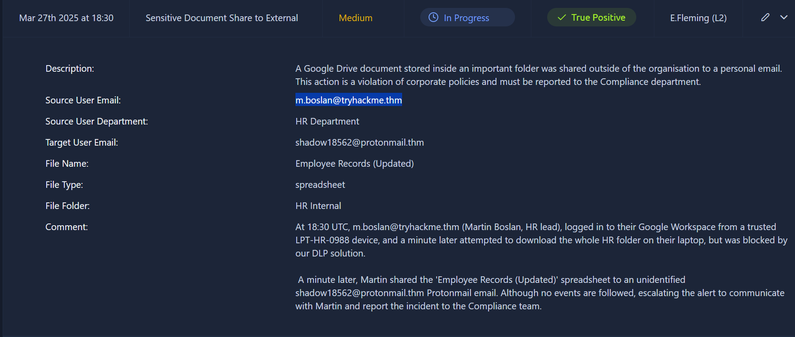
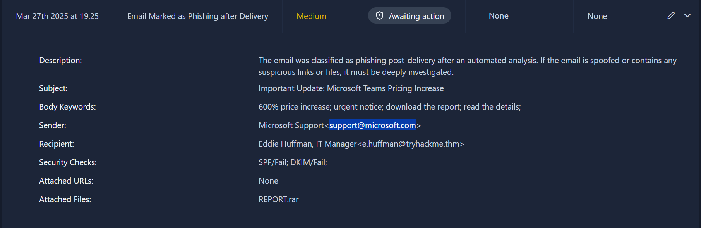
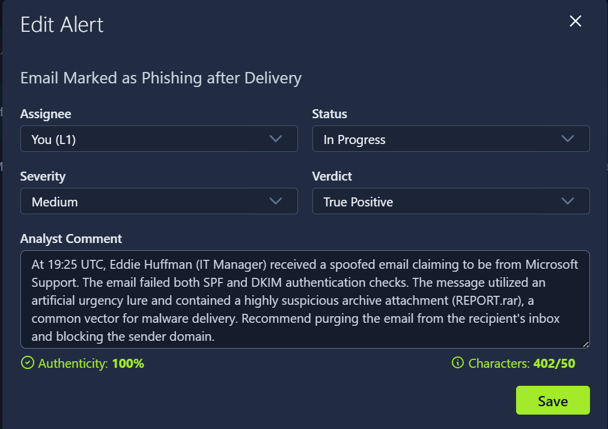
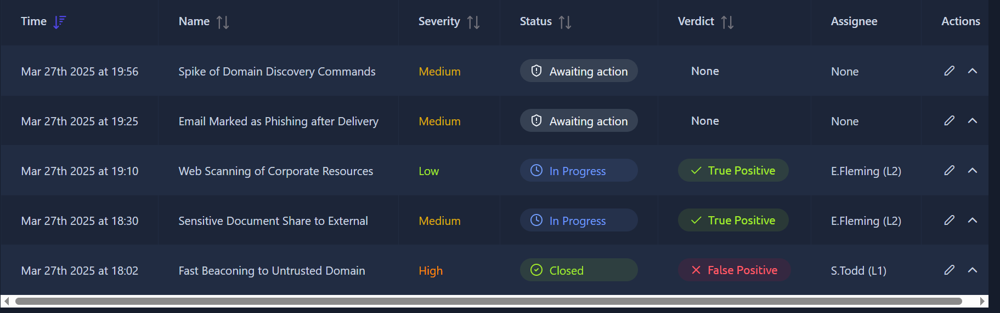
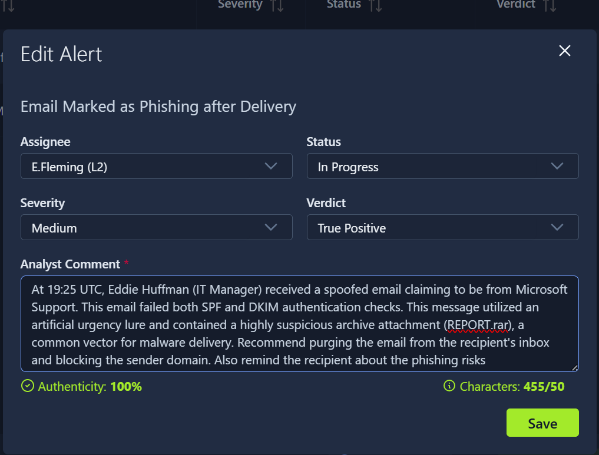
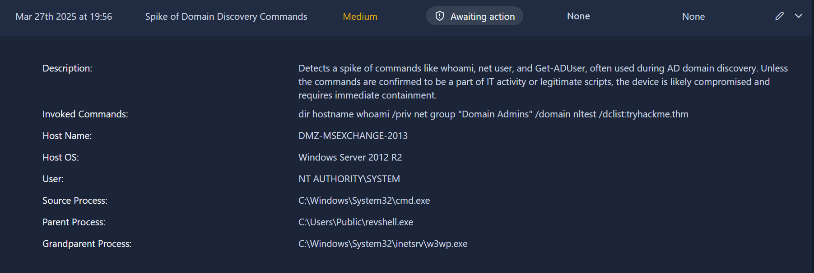
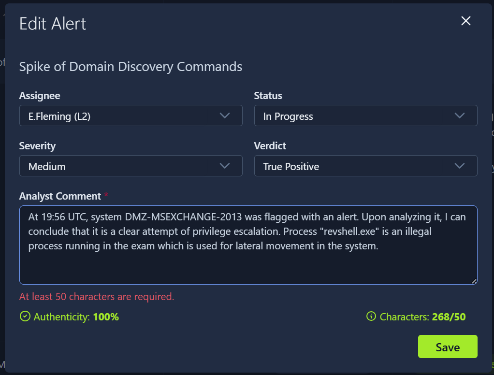

Triage tells you what an alert is. This room covers what happens after: documenting it properly, deciding whether it needs to go to L2, and communicating with other departments when the alert reaches beyond the SOC.

# Task 1: Introduction

No question, setup only. This room continues in the same SOC dashboard from the Alert Triage room, now used for writing reports and escalating instead of just closing alerts.

**Prerequisites:**
[1- SOC L1 Alert Triage](1-%20SOC%20L1%20Alert%20Triage)

# Task 2: Alert Funnel

Three distinct actions live downstream of triage:

- **Alert Reporting** — documenting the full investigation and evidence, especially important for True Positives, so the case doesn't rely on anyone's memory later
- **Alert Escalation** — handing a True Positive that needs deeper work up to L2, with the report attached so they're not starting from zero
- **Communication** — looping in other departments when the alert touches them, e.g. confirming with IT whether admin rights were actually granted to someone before treating a privilege change as suspicious

**What is the process of passing suspicious alerts to an L2 analyst for review?**

Answer
Alert Escalation

**What is the process of formally describing alert details and findings?**

Answer
Alert Reporting

# Task 3: Reporting Guide
why should L1 analysts write detailed reports:

Writing a report earns its keep in three ways: it gives L2 the context to pick up instantly instead of re-investigating, it stays attached to the alert indefinitely so the reasoning survives even if you're not the one who remembers it later, and writing it down forces you to actually understand the issue rather than pattern-match your way to a verdict.

The format is the Five Ws: **Who** was involved, **What** happened, **When**, **Where**, **Why** you reached your verdict.

**According to the [SOC dashboard (opens in new tab)](https://static-labs.tryhackme.cloud/apps/socl1-alertreporting/), which user email leaked the sensitive document?**

Answer
m.boslan@tryhackme.thm

**Looking at the new alerts, who is the "sender" of the suspicious, likely phishing email?**

Answer
support@microsoft.com

**Open the phishing alert, read its details, and try to understand the activity.**  
**Using the Five Ws template, what flag did you receive after writing a good report?**  
**Note: Assign yourself, move the alert to In Progress, and fill in the Analyst Comment.**

**The phishing alert.** SPF and DKIM are both email authentication checks, and both failed here. SPF failing means the email wasn't sent from a server actually authorized to send on that domain's behalf, DKIM failing means the message content was likely tampered with in transit or forged outright. Both failing on an email claiming to be Microsoft support is about as clean a phishing signature as you'll get.

Flag
THM{nice_attempt_faking_microsoft_support}

# Task 4: Escalation Guide
Escalate when: the alert points to a major attack, remediation actions are needed (password reset, host isolation), outside communication is required (management, law enforcement), or you genuinely don't understand the alert well enough to close it confidently.

The flow: L1 reassigns the alert to L2 through proper channels along with the report, L2 picks it up and handles direct communication with whoever's affected (e.g. reminding a phished employee to rotate credentials), and it's explicitly fine, even encouraged, to escalate something you don't fully understand rather than guess.

**Who is your current L2 in the [SOC dashboard (opens in new tab)](https://static-labs.tryhackme.cloud/apps/socl1-alertreporting/) that you can assign (escalate) the alerts to?**

Answer
E.Fleming

**What flag did you receive after correctly escalating the alert from the previous task to L2?**  
**Note: Set the right assignee and add an intermediate verdict (TP or FP)**

We have did the same one in task 3. Open it and edit the assignee. 

Flag
THM{good_job_escalating_your_first_alert}

**Now, investigate the second new alert and provide a detailed alert comment.**  
**What flag did you get after escalating this alert according to the workflow?**

**Second new alert.** The process list shows `cmd` spawning a `revshell.exe` process, alongside commands like `whoami` and `net user`. That combination is a clean signature: a reverse shell process plus reconnaissance commands used to check the attacker's own privilege level and position on the system. This is an active intrusion, not a suspicious-but-unconfirmed alert, so the correct move is immediate escalation to limit further damage.

Flag
THM{looks_like_webshell_via_old_exchange}

## Task 5: SOC Communication

A handful of situational rules worth internalizing:
- L2 unavailable → go to L3, then your manager, know your emergency contacts in advance, don't figure this out mid-incident
- Compromised account → never contact that user over the same (possibly compromised) chat channel, use an alternative method
- Overwhelmed with alerts → still follow the workflow, notify L2 rather than silently falling behind
- Realize you misclassified something → tell L2 immediately, even after time has passed, since a threat actor sitting quietly doesn't mean the risk is gone
- SIEM logs not parsing/searchable → don't skip the alert, extract what you can and report the tooling issue to L2 or the SOC engineer

**Should you first try to contact your manager in case of a critical threat (Yea/Nay)?**

Answer
Nay (chain is L2 > L3 > Manager)

**Should you immediately contact your L2 if you think you missed the attack (Yea/Nay)?**

Answer
Yea

## Detection / Defense Note

The webshell case in Task 4 is the one worth remembering technically: `cmd.exe` spawning a reverse shell binary, followed immediately by `whoami` and `net user`, is a textbook post-exploitation reconnaissance sequence. A detection rule watching for exactly this parent-child process chain (unexpected process spawning `cmd.exe`, which then runs enumeration commands) catches active intrusions before the attacker gets far enough to do real damage, rather than relying on someone noticing the alert queue.

# Lessons Learned

A report isn't paperwork, it's what lets L2 skip re-doing your investigation, which is the entire point of the L1/L2 split existing in the first place. The SPF/DKIM failure combination and the cmd → revshell → whoami chain are both worth keeping as reference patterns: they're common enough that recognizing them instantly, rather than reasoning them out from scratch each time, is what separates a fast triage from a slow one.