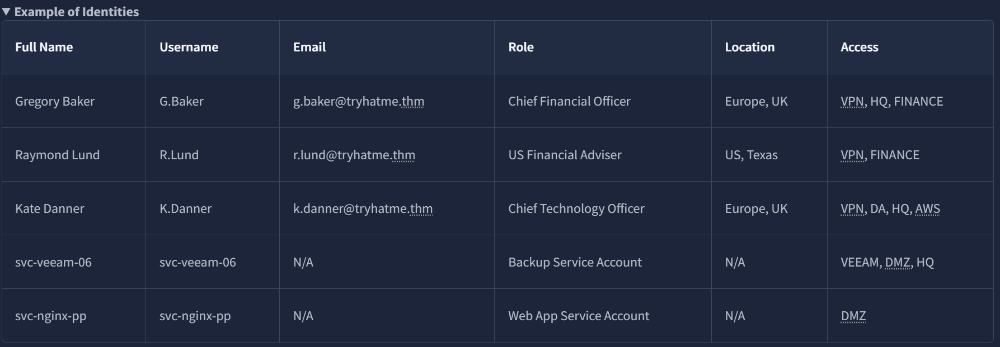
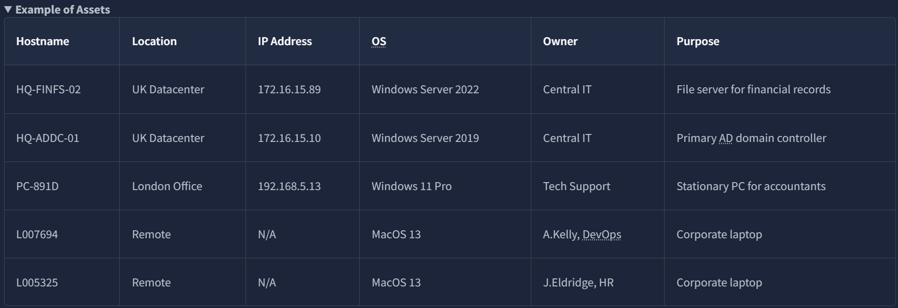
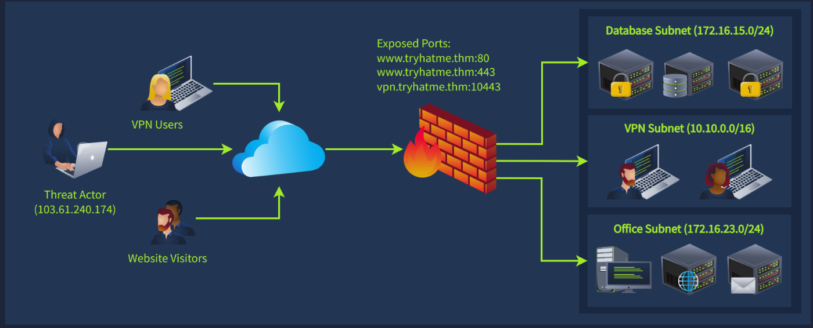
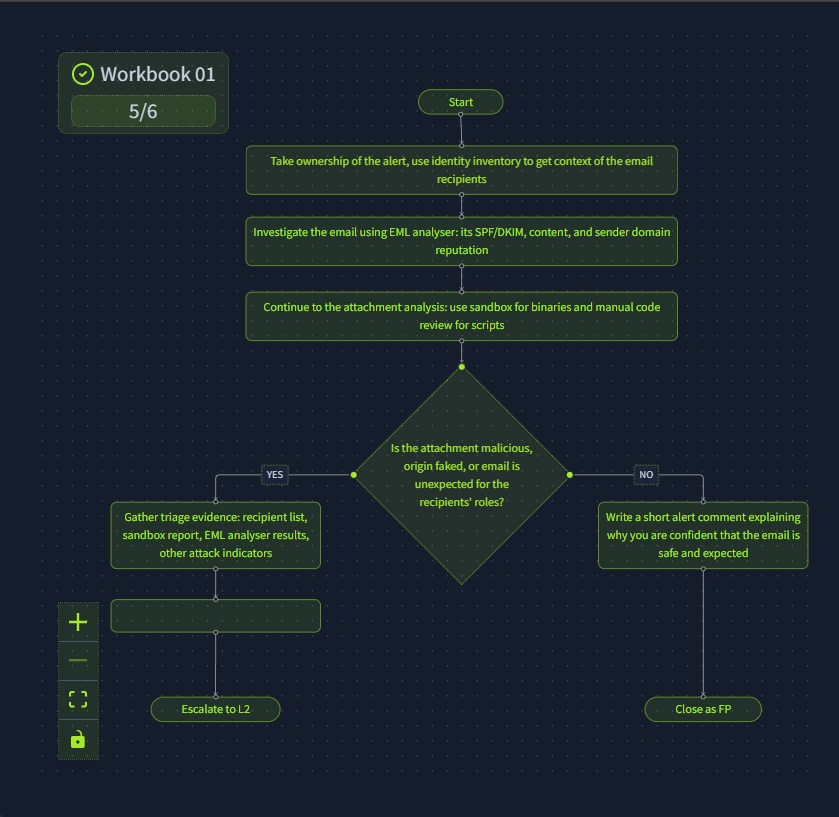
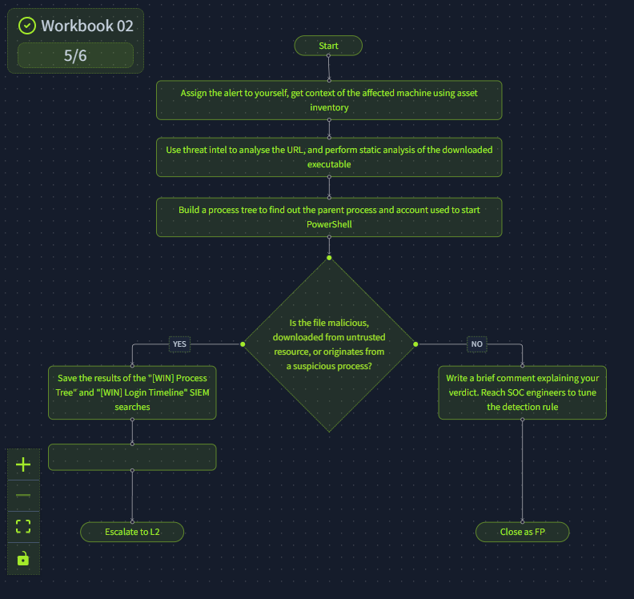
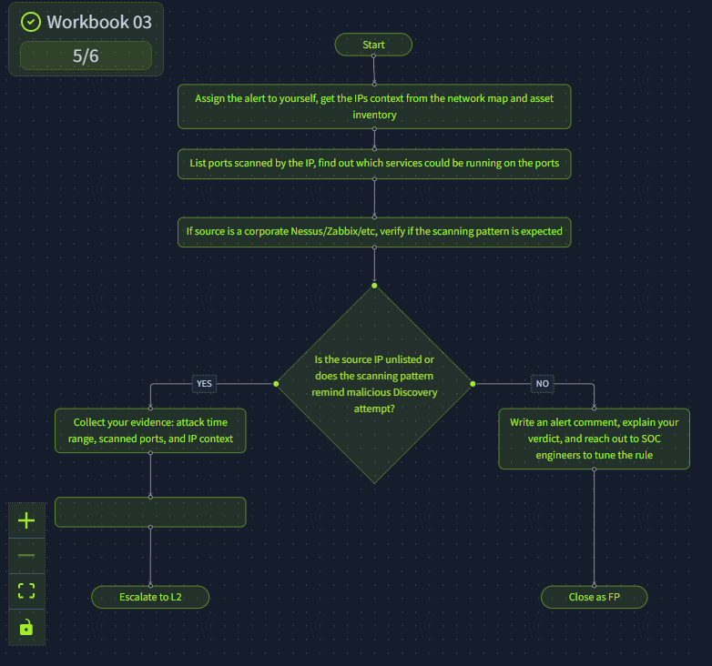

Alert triage often needs more context than the alert itself provides, who this person actually is, what a server actually stores, how the network is actually laid out. This room covers the lookup sources that provide that context and the workbooks that turn them into a repeatable process.

# Task 1: Introduction

**Learning Objects:**
- Familiarize yourself with SOC investigation workbooks
- Learn where to find and how to use asset inventory in SOC
- Understand the importance of corporate network diagrams
- Practice workflow building inside an interactive interface

**Prerequisite:**
[1- SOC L1 Alert Triage](1-%20SOC%20L1%20Alert%20Triage)
[2- SOC L1 Alert Reporting](2-%20SOC%20L1%20Alert%20Reporting)

# Task 2: Assets and Identities
**Identity inventory** is a catalogue of employees and their job details, who they are, what their role is, what access they should have.

**Asset inventory** is the equivalent for infrastructure, a list of computing resources and what each one is for.

**Scenario:** G.Baker logs into `HQ-FINFS-02` and downloads `Financial Report US 2024.xlsx`, then shares it with R.Lund.

**Looking at the identity inventory, what is the role of R.Lund at the company?**

Answer
US Financial Adviser

**Checking the asset inventory, what data does the HQ-FINFS-02 server store?**

Answer
Financial records

**Finally, does the file sharing from the scenario look legitimate and expected? (Yea/Nay)**

Answer
Yea

**The reasoning**: R.Lund is a financial adviser who requested the company's financial records, and G.Baker is the CFO. A CFO sharing financial records with the person whose job is advising on finances, on request, is exactly what should happen. Without checking identity inventory first, this same transfer could easily be misread as data exfiltration.

# Task 3: Network Diagrams

**Scenario:** an external IP (`103.61.240.174`) repeatedly connects to the corporate firewall on TCP/10443. Firewall logs then show it got assigned an internal IP (`10.10.0.53`). That internal IP scans the `172.16.15.0/24` range and finds nothing open, then shifts to scanning `172.16.23.0/24`.

Reading this against the network diagram: the repeated connection attempts on 10443 look like a brute-force attempt against a VPN service. Once it succeeds, the attacker gets assigned an IP from the VPN subnet, standard behavior for any VPN client. The first scan target being the Database subnet and coming back empty suggests firewall rules blocked it, and the pivot to a second subnet right after is the attacker searching for a softer target after the first one didn't pan out.

**According to the network diagram, which service is exposed on the TCP/10443 port?**

Answer
VPN

**Now, which subnet would the server behind 172.16.15.99 IP belong to?**

Answer
Database Subnet

**Finally, does the scenario look like a True Positive (TP) or False Positive (FP)?**

Answer
TP

# Task 4: Workbooks theory
A **SOC workbook** is a structured document laying out the exact steps to investigate a specific alert type consistently. L2 analysts usually build them for L1s, since L1s haven't seen every possible attack pattern yet, and workbooks exist precisely to close that experience gap without needing years on the job first.

The sample workbook for corporate login alerts splits into three stages: **Enrichment** (pull threat intel and identity inventory on the user), **Investigation** (use that plus SIEM logs to call it TP or FP), **Escalation** (send to L2 or contact the user directly if warranted).

**Which SOC role would use workbooks the most (e.g. SOC Manager)?**

Answer
SOC L1 Analyst

**What is the process of gathering user, host, or IP context using TI and lookups?**

Answer
Enrichment

**Looking at the workbook example, what platform is used as an identity inventory source?**

Answer
BambooHR

# Task 5: Workbooks Practice

Three workbooks, each walked through to completion. The recurring last step across all three, deliberately, is the same: write the report and comments before closing or escalating. That's the room reinforcing the previous room's lesson rather than treating it as a one-time rule.

**What flag did you receive after completing the first workbook?**

 The first 3 steps are all about taking the ownership of the alert and getting all the context and information about the situation, email and the attachments it have. Then we either conclude the email to be safe and close it as FP or we gather all the evidence and escalate it to the L2 analyst with a summary and report

Flag
THM{the_most_common_soc_workbook}

**What flag did you receive after completing the second workbook?**

Same here, we assign the alert to ourselves. Collect all the information and context and conclude as FP or triage to L2

Flag
THM{be_vigilant_with_powershell}

**What flag did you receive after completing the third workbook?**

Repeat the pattern

Flag
THM{asset_inventory_is_essential}

## Detection / Defense Note

The network diagram case in Task 3 is a good template for lateral movement recognition generally: external brute force → internal foothold → scan one subnet → get blocked → pivot to a different subnet. Each step alone might look like noise (a failed scan isn't automatically malicious), but the sequence, especially the pivot after a blocked scan, is what makes this a confirmed True Positive rather than a maybe. A SOC watching for this exact shape (repeated external auth attempts followed by internal scanning across multiple subnets in a short window) can catch active lateral movement instead of waiting for a compromised host to declare itself.

# Lessons Learned

Context from identity and asset inventory can flip a verdict entirely, the exact same file transfer between two users is either routine business or exfiltration depending entirely on who they are and what their roles justify. Workbooks exist so that this context-gathering step doesn't depend on an L1 analyst's personal experience or memory, it's written down once by someone who's seen the pattern before and reused consistently after that.