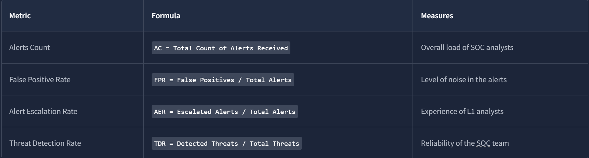
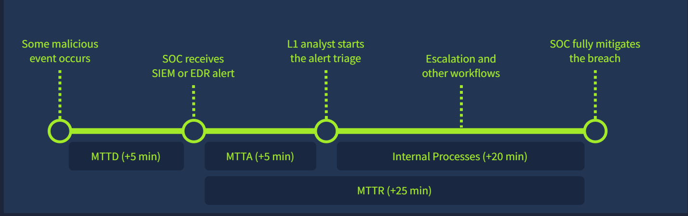
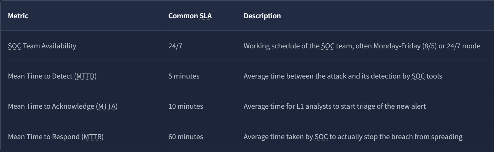
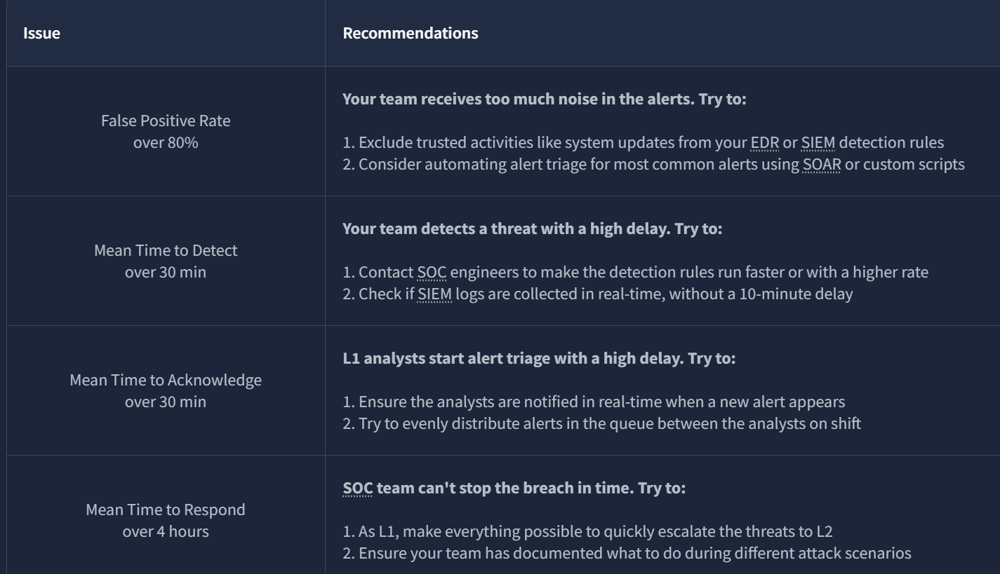
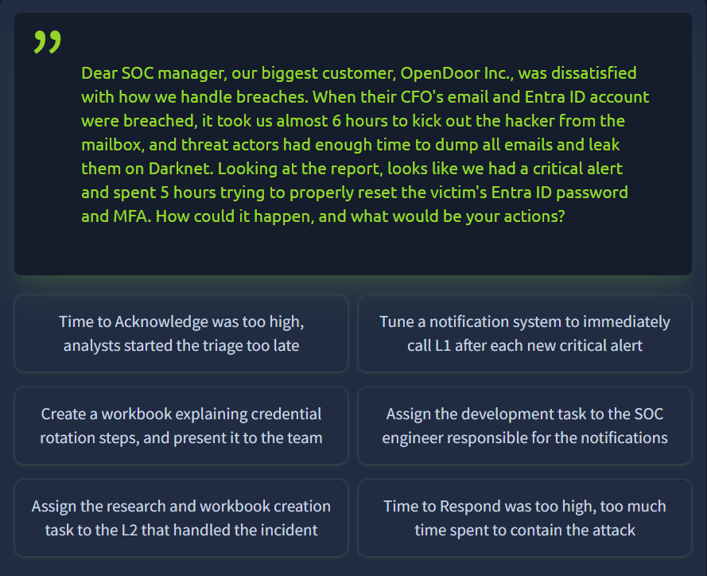
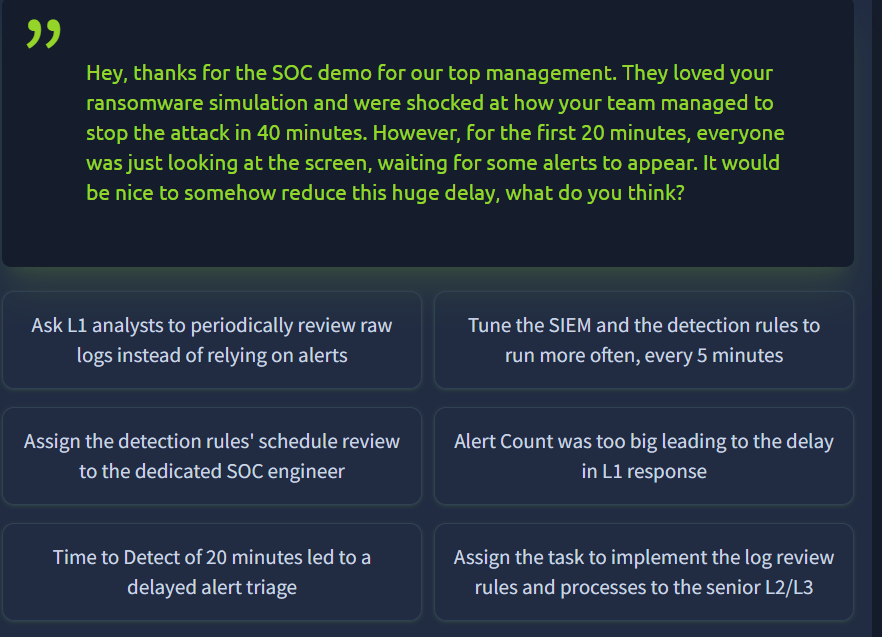
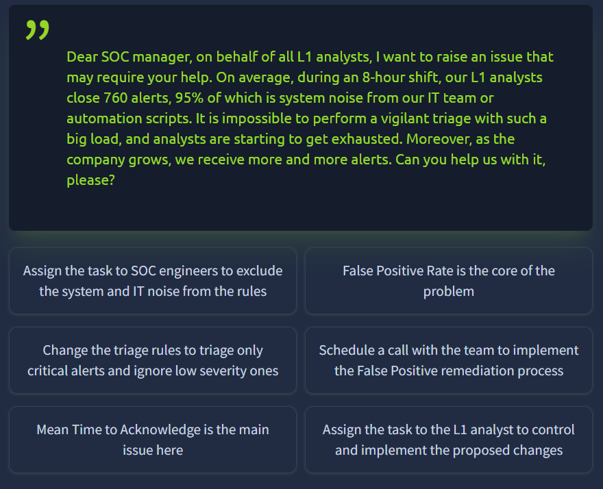

Doing good triage isn't enough on its own, a SOC also has to prove it's effective, and that's measured in specific numbers. This room covers the core metrics that define whether a SOC team is actually working, and what to do when they aren't.

# Task 1: Introduction

No question, setup only.

Prerequisites:
[3- SOC Workbooks and Lookups](3-%20SOC%20Workbooks%20and%20Lookups)

# Task 2: Core Metrics

Four metrics worth knowing cold:

**Alerts Count** — 5 to 30 per day per L1 analyst is a healthy range, depending on company size. Too many buries real threats in noise, too few can mean the SIEM itself has a visibility gap, not that the company is actually quiet.

**False Positive Rate** — a high FPR (above roughly 80%) is dangerous specifically because it makes the team complacent, not just inefficient. A 0% FPR is not a realistic target. The fix is tuning detection rules, sometimes called False Positive Remediation, not just telling analysts to be more careful.

**Alert Escalation Rate** — reflects how experienced an L1 analyst is. Aim below 50%, ideally below 20%. But this cuts both ways: L1's job is filtering noise before it reaches L2, but an L1 who never escalates anything they genuinely don't understand, just to keep their rate low, is a worse outcome than escalating a little too often.

**Threat Detection Rate** — this one has no acceptable middle ground, it should be 100%. A single missed detection can mean data exfiltration or ransomware, there's no "mostly caught it."

**Is zero alerts for one month a good sign for your SOC team? (Yea/Nay)**

Answer
Nay

**What is the False Positive Rate if only 10 out of 50 alerts appear to be real threats?**

Answer
80%

# Task 3: Triage Metrics
An **SLA (Service Level Agreement)** is a signed commitment between the SOC and company management (or between an MSSP and its client) covering three timing requirements:

- **MTTD** (Mean Time To Detect) — how long between the actual event and the alert being raised
- **MTTA** (Mean Time To Acknowledge) — how long until an analyst picks it up
- **MTTR** (Mean Time To Respond) — how long until the threat is actually contained/resolved

Metrics:

**Imagine a scenario where the SOC team receives a critical alert on Saturday.**  
**If the team works 8/5, on which day of the week will they acknowledge the alert?**

Answer
Monday

**Scenario:** "Connection to Redline Stealer C2" alert received after 12 minutes. An L1 analyst moves it to In Progress 10 minutes later. After 6 more minutes it's escalated to L2, who spends 35 minutes cleaning the malware.

Breaking down the math: MTTD is the 12 minutes from event to alert, that's a detection-speed number, independent of anyone acting on it yet. MTTA is the 10 minutes until an analyst actually picks it up. MTTR builds on top of MTTA, it's the acknowledgement time plus everything that happens afterward to actually resolve it, here that's the 6 minutes to escalate plus the 35 minutes L2 spent remediating: `MTTR = MTTA + (escalation time + remediation time) = 10 + (6 + 35) = 51`.

**Q: Provide MTTD, MTTA, MTTR as a comma-separated answer.**

Answer
12,10,51

# Task 4: Improving Metrics
Metrics exist for two reasons: making the SOC more efficient overall, and evaluating individual L1 performance.

How to improve your metrics:

**What is the highest acceptable False Positive Rate for SOC teams?**

Answer
80%

**Should all SOC roles work together to keep metrics improving? (Yea/Nay)**

Answer
Yea

# Task 5: Practice Scenario

Three scenarios, each requiring you to identify the broken metric, the right fix, and who should own it.

**What flag did you get after completing the first scenario?**

**Scenario 1.** Response time was too slow, too much time elapsed containing the attack once it was already found. The fix isn't detection-side, it's building a documented credential-rotation workbook so response doesn't stall on figuring out steps mid-incident, assigned to the L2 who actually handled that incident since they have the direct context.

Flag
THM{mttr:quick_start_but_slow_response}

**What flag did you get after completing the second scenario?**

**Scenario 2.** A 20-minute detection delay meant triage started late through no fault of the analyst, the alert simply arrived too slowly. The fix is tuning the SIEM/detection rules to run more frequently (every 5 minutes instead of whatever the current interval is), assigned to the dedicated SOC engineer since this is a tooling problem, not an analyst one.

Flag
THM{mttd:time_between_attack_and_alert}

**What flag did you get after completing the third scenario?**
**Scenario 3.** The False Positive Rate itself is the core problem. The fix is scheduling a team-wide False Positive remediation pass, assigned to SOC engineers specifically to exclude known system and IT noise from the detection rules, again a tooling fix, not an analyst discipline issue.

Flag
THM{fpr:the_main_cause_of_l1_burnout}

## Detection / Defense Note

The pattern across all three practice scenarios is worth internalizing on its own: none of the three fixes were "tell the analyst to try harder." A slow MTTR got fixed with a workbook, a slow MTTD got fixed by tuning detection frequency, a bad FPR got fixed by excluding noise at the rule level. Metrics problems are almost always process or tooling problems, treating them as an individual performance issue instead just produces burnout without fixing the actual number.

# Lessons Learned

MTTD, MTTA, and MTTR measure three different things and stack on top of each other rather than overlapping, mixing them up is the easiest way to misdiagnose where a SOC is actually slow. The FPR ceiling (80%) and the "escalation rate below 20%" range aren't arbitrary either, they're both trying to balance the same tension: catch real threats without burning out the team on noise, and don't let an L1's fear of a high escalation rate become a reason to sit on something they don't actually understand.