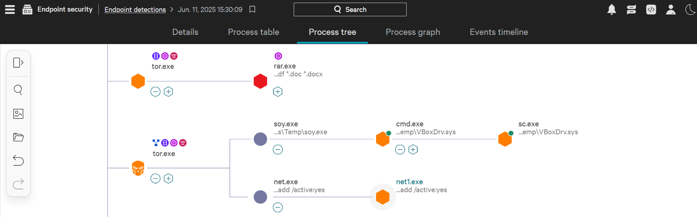
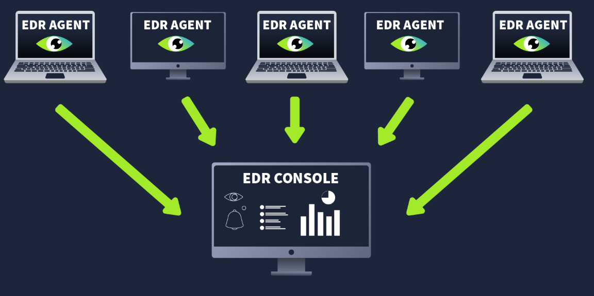
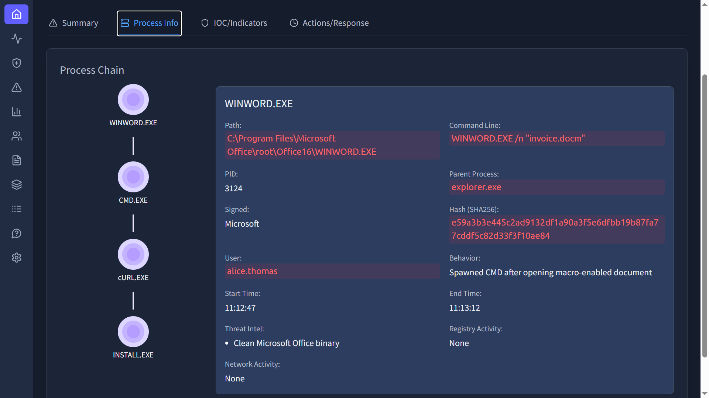
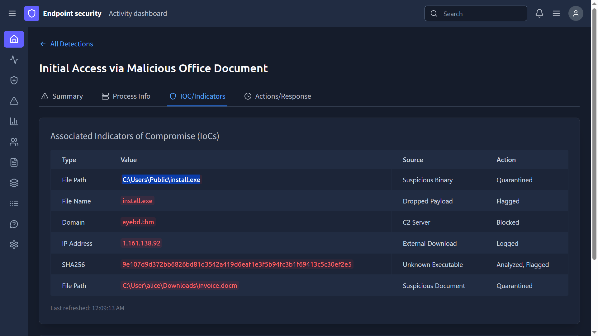
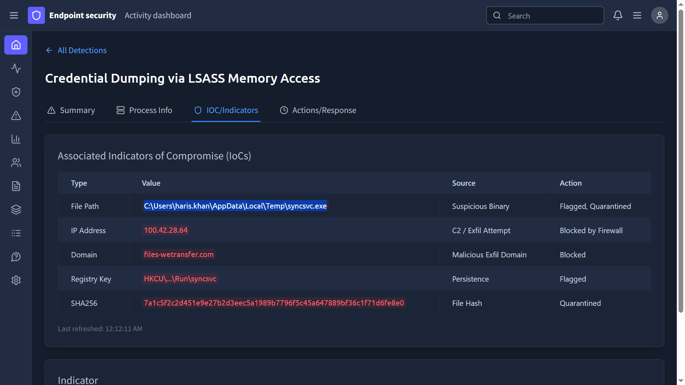
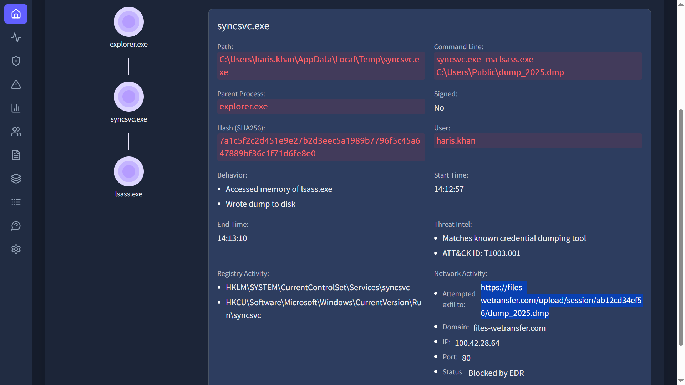
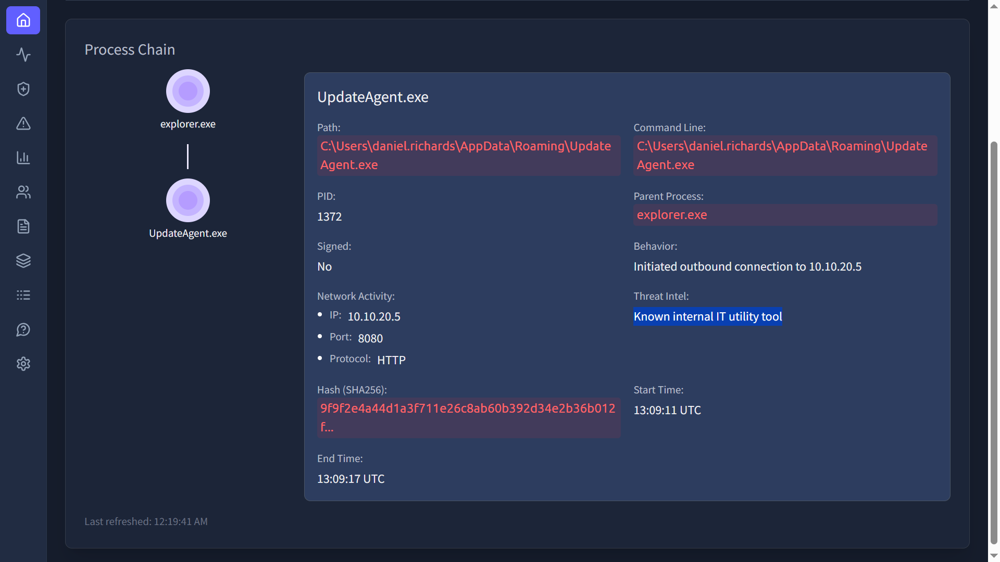

Antivirus catches what it already knows. This room covers the tool built for what AV misses, Endpoint Detection and Response, how it's architected, what it watches, and how to actually use one to investigate a live alert across multiple endpoints.

# Task 1: Introduction

No question, setup only.

**Prerequisites:**
Awareness of role of SOC team

# Task 2: What is an EDR
EDR is a security solution that gives deep, continuous visibility into what's happening on an endpoint, not just a periodic scan against a signature list. 
Real products in this space include **CrowdStrike Falcon**, **SentinelOne**, **Microsoft Defender for Endpoint**, and **OpenEDR**.

Three features carry the whole value proposition:

- **Visibility** — process, registry, and file activity, in structured form, with historical lookback per endpoint
- **Detection** — machine learning flags behavior that's out of the ordinary for that user or host
- **Response** — the analyst can act directly from the console, no separate tool needed

**Which feature of EDR provides a complete context for all the detections?**

Answer
Visibility

**Which process spawned sc.exe?**

Answer
cmd.exe (visible as the parent process in the process tree)

# Task 3: Beyond the Antivirus

The room's own analogy is a good one to keep: **Antivirus is an immigration check**, it only stops what's already on a forbidden list. **EDR is airport security with CCTV**, even if something slips past the checkpoint, ongoing behavioral monitoring can still catch it acting suspiciously later. That's the real gap AV has: it's blind to anything with a clean or unknown signature, while EDR is watching for the behavior itself, not just the file's reputation.

**In the given analogy, what presents an AV?**

Answer
Immigration check

**Which legitimate process was hijacked by the attacker in the scenario?**

Answer
svchost.exe

**Which security solution might mark this activity as clean?**

Answer
Antivirus

This last answer is really the whole lesson of the task: a hijacked, legitimate, digitally-signed process is exactly the case where AV's signature-matching approach fails, there's no bad file to flag, just a trusted process being misused.

# Task 4: How an EDR works?

The pipeline: an **agent** is deployed on each endpoint, it watches for threats and forwards data to the **EDR console**. The console analyzes what comes in, forms detections (alerts), assigns severity, and gives the analyst everything needed, including response actions, in one place, no need to jump between tools.

**Which component of the EDR is responsible for collecting telemetry from the endpoints?**

Answer
Agent

**An EDR agent is also known as a?**

Answer
Sensor

# Task 5: EDR Telemetry
**Telemetry** is the raw data agents send up to the console. Categories worth knowing:

- Process executions/terminations
- Network connections
- Command-line activity
- File/folder modifications
- Registry modifications

**Which telemetry data helps in detecting C2 communications?**

Answer
Network connections

**Where are the configuration settings of a Windows system primarily stored?**

Answer
Registry

# Task 6: Detection and Response Capabilities
**Detection side:** behavioral detection (watches the whole behavior of a process, not a single action), anomaly detection (flags uncommon behavior for that host/user), IOC matching (flags known-bad indicators directly), MITRE ATT&CK mapping (ties activity to a named tactic/technique), and machine learning trained on large datasets to catch complex attack patterns.

**Response side:** isolate a host (stop lateral movement), terminate a process, quarantine a file, remote shell access, and artifact collection for further analysis.

**Which feature of the EDR helps you identify threats based on known malicious behaviors?**

Answer
IOC Matching

## Task 7: Investigate an alert on EDR

This is the room's actual hands-on task, four separate mini-investigations across different endpoints, using the console's process tree, IOC/Indicators tab, and per-process network activity view.

**Which tool was launched by CMD.exe to download the payload on DESKTOP-HR01?**

**DESKTOP-HR01 — payload download.** The process info tab shows `cmd.exe` spawning the download tool directly.

Answer
cURL.EXE

**What is the absolute path to the downloaded malware on the DESKTOP-HR01 machine?**

Answer
C:\Users\Public\install.exe

Worth noting: the file landed in the Public folder but the summary confirmed it was never executed, meaning this is a dropped file, not yet an active infection. That distinction changes the urgency of the response.

**What is the absolute path to the suspicious syncsvc.exe on the WIN-ENG-LAPTOP03 machine?**

**WIN-ENG-LAPTOP03 — suspicious process.** Checking the IOC/Indicators tab surfaces the file path directly.

Answer
C:\Users\haris.khan\AppData\Local\Temp\syncsvc.exe

A temp-folder path for something posing as a sync service is itself a mild red flag before even looking deeper, legitimate sync utilities don't typically live in a user's temp directory.

**On which URL was the exfiltration attempt being made on WIN-ENG-LAPTOP03?**

Answer
https://files-wetransfer.com/upload/session/ab12cd34ef56/dump_2025.dmp

`syncsvc.exe` was already flagged for an attempted exfiltration, clicking into that process's network activity surfaces the exact destination URL it was trying to reach.

**What was UpdateAgent.exe labelled by Threat Intel on DESKTOP-DEV01?**

**DESKTOP-DEV01 — threat intel labeling.** Not every flagged process is malicious, this one is a good example of why context matters before reacting.

Answer
Known internal IT utility tool

## Detection / Defense Note

Task 7's DESKTOP-DEV01 case is the one worth remembering: not everything the EDR surfaces is a threat, and treating every flagged process as hostile without checking threat intel context wastes response time and erodes trust in the tool. On the other end, the WIN-ENG-LAPTOP03 case shows why a temp-directory execution path plus an outbound transfer to a generic file-sharing domain is a strong combined signal even before any malware signature is involved, both indicators are behavioral, not signature-based, which is exactly the class of detection AV misses and EDR exists to catch.

# Lessons Learned

The immigration-check-vs-airport-security analogy holds up well beyond this room: any detection approach built purely on "does this match a known-bad list" will always miss a legitimate process doing something it shouldn't (Task 3's hijacked svchost.exe) or a brand-new tool with no reputation yet. Also worth carrying forward: a dropped-but-unexecuted file (DESKTOP-HR01) and an actively exfiltrating process (WIN-ENG-LAPTOP03) are very different urgency levels even though both start as "the EDR flagged something," the response decision has to match which stage of the attack you're actually looking at.