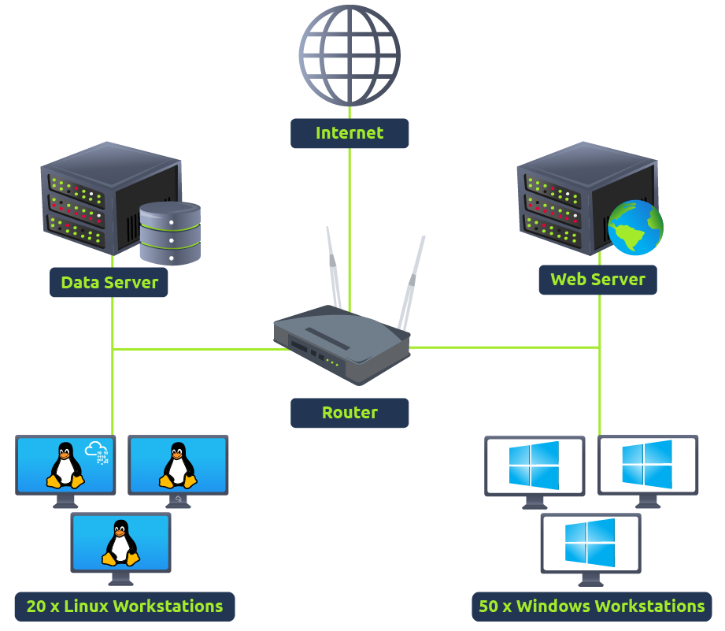
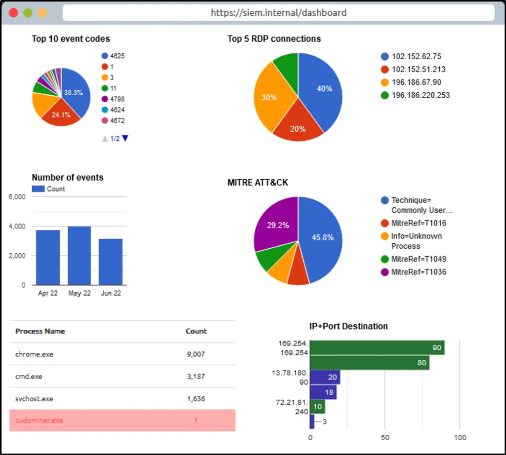
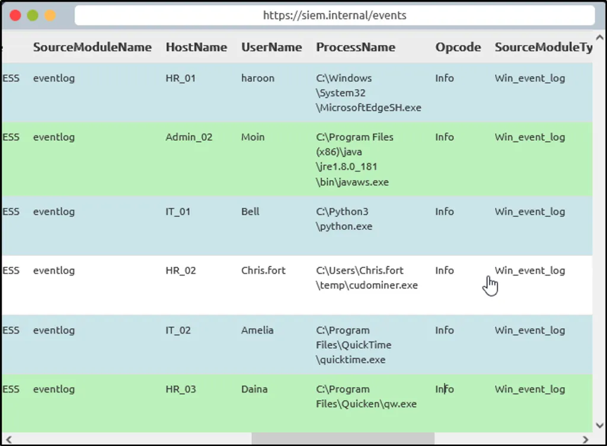
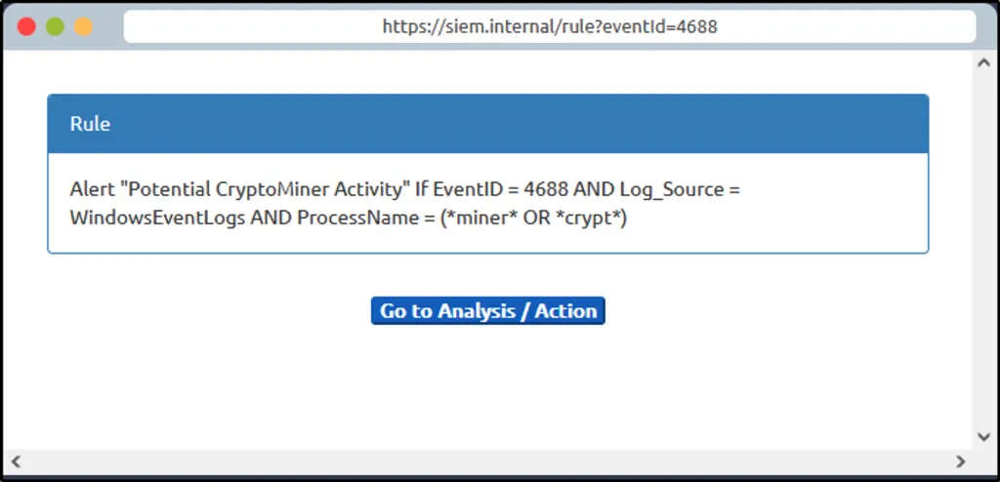

EDR covers the endpoint. This room covers the platform that pulls logs from everywhere, endpoints, network devices, servers, and turns them into something an analyst can actually search and correlate instead of drowning in.

# Task 1: Introduction

**What does SIEM stand for?**

Answer
Security Information and Event Management system

# Task 2: Logs Everywhere, Answers Nowhere

Every connected device is constantly generating logs, the trail of everything it does. These split into two categories:

**Host-Centric** — tied to the host itself: file access, authentication attempts, process execution, registry key changes, PowerShell execution.

**Network-Centric** — generated when hosts talk to each other or the internet: SSH connections, FTP file access, web traffic, VPN, network file sharing.

The problem this task sets up: a single log source can generate roughly 100 logs per second. Manually reviewing each one, correlating across sources, or getting full context from a single isolated log is not realistic at that volume. That's the actual reason a centralized platform exists, not because logs are hard to read individually, but because no human can correlate thousands of them per minute across dozens of sources by hand.

**Is Registry-related activity host-centric or network-centric?**

Answer
Host-Centric

**Is VPN-related activity host-centric or network-centric?**

Answer
Network-Centric

# Task 3: Why SIEM?
A SIEM solves exactly the volume/correlation problem from Task 2, through five core features: standardized log collection, normalization (getting inconsistent log formats into one consistent structure), correlation across sources, real-time alerting, and dashboards/reporting.

# Task 4: Log Sources and Ingestion

**Windows** logs land in Event Viewer and get forwarded to the SIEM from there.

**Linux** spreads logs across specific paths worth memorizing: `/var/log/httpd` (HTTP request/response and errors), `/var/log/cron` (scheduled job events), `/var/log/auth.log` and `/var/log/secure` (authentication), `/var/log/kern` (kernel events).

**Web servers** specifically need their own monitoring, `/var/log/apache` and `/var/log/httpd` on Linux, since web-facing logs are often the first place an attack shows up.

Ingestion methods: an **agent/forwarder** installed on the endpoint pushes logs to the SIEM, **syslog** sends real-time data to a centralized collector, **manual upload** (some platforms like Splunk support ingesting offline data directly), and **port-forwarding**, where the SIEM listens on a configured port for incoming data.

**In which location within a Linux environment are HTTP logs stored?**

Answer
/var/log/httpd

# Task 5: Alerting Process and Analysis
Detection rules are how a SIEM turns raw log volume into something actionable. Two worked examples from the room:

**Event log deletion.** Attackers commonly clear logs to cover their tracks after an operation. Windows Event ID **104** fires specifically when someone attempts to clear the event log, so a rule watching for that single event ID directly catches an anti-forensics attempt: `WinEventLog AND EventID 104 → "Event Log Cleared"`.

**Command execution monitoring.** Attackers commonly run `whoami` right after gaining access, to check what privilege level they landed with. A rule built around Event Code **4688** (process creation) with the `NewProcessName` field containing `whoami` catches this specific reconnaissance step: `WinEventLog AND EventCode 4688 AND NewProcessName contains whoami → "WHOAMI command Execution DETECTED"`.

After a rule fires, the analyst's job is deciding what happens next: tune the rule if it's a false positive (reduce future noise), investigate further if it's a true positive, contact the asset owner to check on unusual-but-maybe-legitimate activity, isolate the host if compromise is confirmed, or block the offending IP.

**Which Event ID is generated when event logs are removed?**

Answer
104

**What type of alert may require tuning?**

Answer
false positive

# Task 6: Lab Work

A live simulated alert to triage from scratch.

**After clicking on the _Start Suspicious Activity button,_ which process caused the alert?**

Answer
cudominer.exe

**Find the event that caused the alert and identify the user responsible for the process execution.**

Answer
Chris

**What is the hostname of the suspect user?**

Answer
HR_02

**Examine the rule and the suspicious process; which term matched the rule that caused the alert?**

Answer
Miner (matched from the process name "cudominer")

**Which option best represents the event? Choose from the following:**

- **False Positive**

- **True Positive**

Answer
True Positive, cudominer.exe is a cryptomining automation tool, not a legitimate business process

**Selecting the right ACTION will display the FLAG. What is the FLAG?**

Flag
THM{000_SIEM_INTRO}

