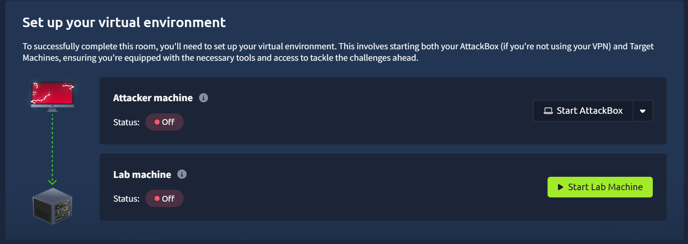
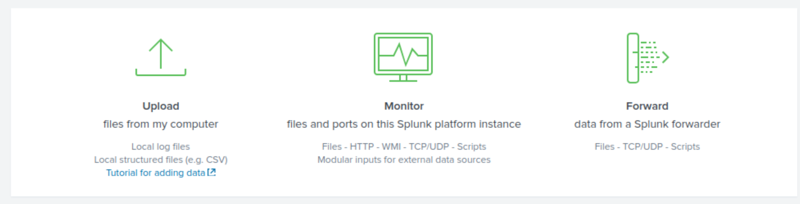
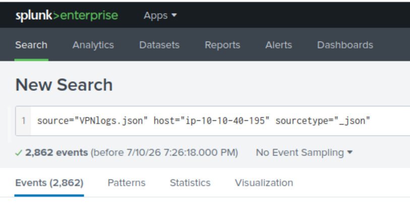
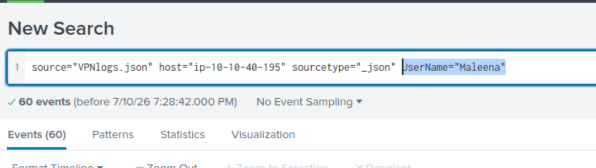
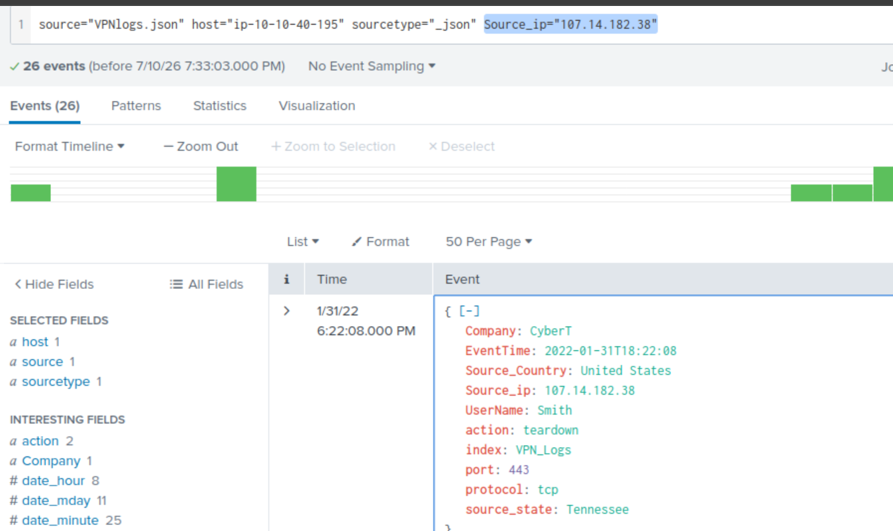
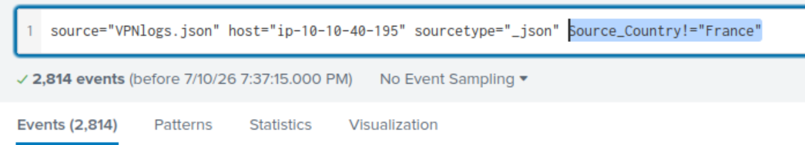
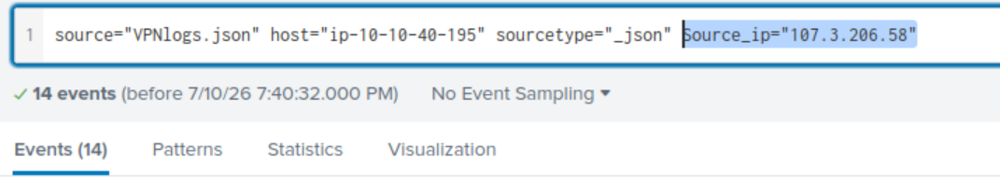

The previous room covered SIEM theory. This one puts it into practice with Splunk, one of the most widely deployed SIEM platforms, covering its architecture and then actually ingesting and querying a real VPN log file.

# Task 1: Introduction

No question, setup only.

Prerequisites:
[2- Introduction to SIEM](2-%20Introduction%20to%20SIEM)

# Task 2: Connect with the lab
Standard TryHackMe VM setup, start the AttackBox (recommended for beginners over a personal VPN connection) and the target machine, then access the Splunk instance at `http://<machine-IP>`.

# Task 3: Splunk Components
Three pieces, each with a distinct job:

- **Forwarder** — installed on the endpoint, collects data (web traffic, Windows event/PowerShell/Sysmon logs, Linux host-centric logs, DB connections and errors) and ships it onward
- **Indexer** — receives that data, parses and normalizes it into field-value pairs, categorizes it, and stores it as searchable events
- **Search Head** — where the analyst actually searches, sends queries to the indexer, gets results back as field-value pairs, with table and visualization options built in

**Which component is used to collect and send data over the Splunk instance?**

Answer
Forwarder

# Task 4: Navigating Splunk

The Splunk Bar gives access to Messages (system notifications), Settings (instance configuration), Activity (search job progress), Help (docs/tutorials), and Find (cross-app search), plus switching between installed apps. **Search and Reporting** is the default app.

The Apps Panel lists installed apps, and Explore Splunk gives quick links to add data, install new apps, or jump to documentation. No dashboards show by default, but you can select from existing ones or build custom ones under the "Yours" tab.

 **In the Add Data tab, which option is used to collect data from files and ports?**
 
 Here after clicking on the "Add Data" option, we are taken to this option where we can see that the "Monitor" option gives us the chance to collect data from files and ports

Answer
Monitor

# Task 5: Adding Data

Splunk processes any ingested data into individual events, regardless of source (event logs, website logs, firewall logs, etc.). The upload flow is five steps: **Select Source** → **Select Source Type** → **Input Settings** (index name, hostname) → **Review** → **Done**.

**The task's actual lab:** upload the provided VPN log data into a new index named `VPN_Logs`then answer a series of questions purely by searching and filtering the ingested data. This is the room's only real hands-on stretch, everything before it was navigation.

**Upload the data attached to this task and create an index "VPN_Logs". How many events are present in the log file?**

Answer
2862

**How many log events are captured by the user Maleena?**

Answer
60 (filter by UserName = Maleena)

**What is the username associated with IP 107.14.182.38?**

Answer
Smith (filter by source_ip)

**What is the number of events that originated from all countries except France?**

Answer
2814 (filter with '!=' France)<

**How many VPN events were associated with the IP 107.3.206.58?**

Answer
14

## Detection / Defense Note

Not much room for a novel detection angle here since this task is search mechanics rather than an incident scenario, but the pattern is the actual takeaway: field-based filtering (`UserName=`, `source_ip=`, `!=` exclusions) is the entire foundation of SPL querying, and every one of these five questions is solved with the same basic filter-and-count pattern applied to a different field. Get comfortable with that pattern and most SPL work in the field is a variation on it.

# Lessons Learned

Splunk's three-component split (Forwarder collects, Indexer normalizes and stores, Search Head queries) maps directly onto the generic SIEM architecture from the previous room, this isn't new theory, it's the same pipeline with Splunk's specific names attached. Worth remembering for any SIEM, not just Splunk: exclusion filters (`!= France`) are often faster than trying to enumerate every value you actually want, especially when you're looking for "everything except the expected baseline."
