Not every SOC runs Splunk. This room covers ELK, Elasticsearch, Logstash, Kibana, which isn't a traditional SIEM product but gets used like one constantly because of its search and visualization strength, then puts it to work investigating the same kind of VPN log data as the Splunk room, this time through Kibana's Discover tab and KQL.

# Task 1: Introduction
No question, setup only. Worth noting upfront: ELK wasn't originally built for security, it started as a general-purpose search and visualization tool for large datasets, SOC adoption came later because the search/filter/dashboard capability transfers directly.

# Task 2: Elastic Stack Overview

Four components, each doing one job in the pipeline:
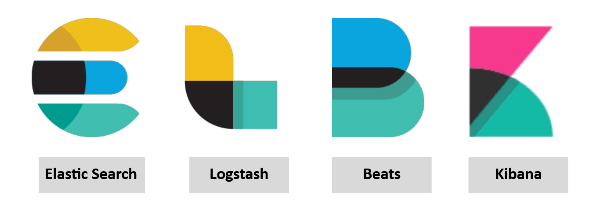

- **Elasticsearch** — full-text search and analytics engine for JSON documents, stores/analyzes/correlates data, exposes a RESTful API
- **Logstash** — data processing engine, pulls from various sources, filters/normalizes, sends onward. Its config splits into **Input** (source), **Filter** (normalization rules), **Output** (destination, often Kibana or a listening port)
- **Beats** — lightweight host-based agents that ship data from endpoints into Elasticsearch
- **Kibana** — the visualization and investigation layer, works with Elasticsearch to search/analyze/visualize in real time

**Flow:** Beats collect from endpoints → Logstash normalizes into field-value pairs → Elasticsearch stores/indexes it → Kibana displays it.
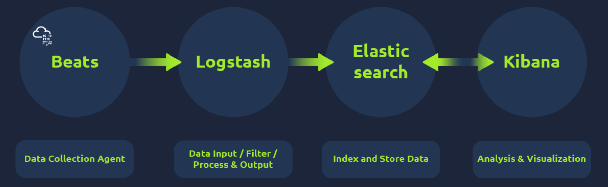

**Logstash is used to visualize the data. (yay/nay)**

Answer
Nay, that's Kibana's job

**Elasticsearch supports all data formats apart from JSON. (yay/nay)**

Answer
Nay, Elasticsearch works specifically with JSON-formatted documents

# Task 3: Lab Connection
Start the AttackBox and target machine, log into ELK/Kibana with the provided URL and credentials.

# Task 4: Discover tab

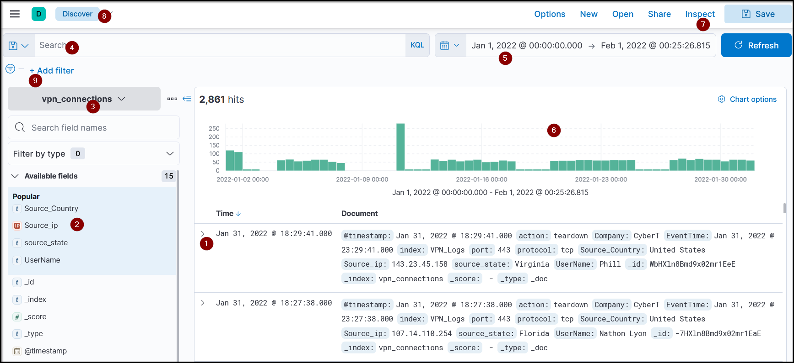
The Discover tab is Kibana's main investigation workspace. Key pieces: the log list itself, a **Fields Pane** listing every parsed field (clickable to add as a filter), an **Index Pattern** selector (different log types live in different indices), the **Search Bar** for queries, a **Time Filter** to narrow the window, a **Time Interval** chart showing event counts over time, and an **Add Filter** option for field-specific narrowing.

**Select the index vpn_connections and filter from 31st December 2021 to 2nd Feb 2022. How many hits are returned?**
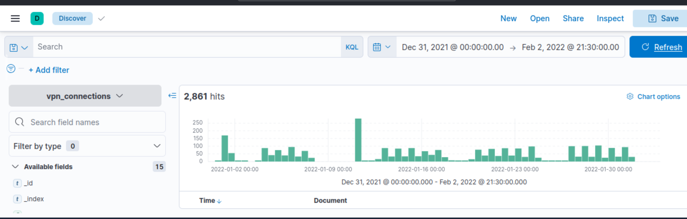Apply Time filter of the specified dates and we can see the events/hits

Answer
2861

**Which IP address has the maximum number of connections?**
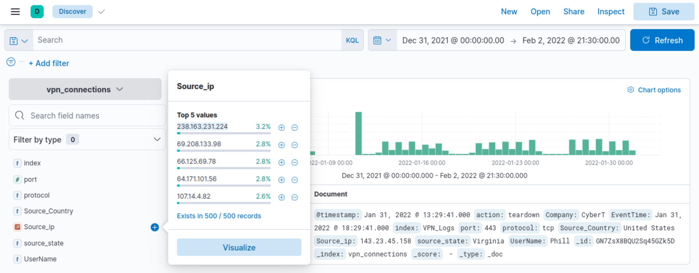

Answer
238.163.231.224 (found by clicking `source_ip` in the Fields Pane to see the top values, or via Visualize for a chart view)

**Which user is responsible for the overall maximum traffic?**
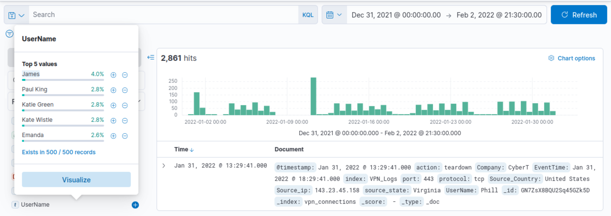Now similarly we find "UserName" on the field pane and get the top 5 users

Answer
James

**Apply Filter on UserName Emanda; which SourceIP has max hits?**
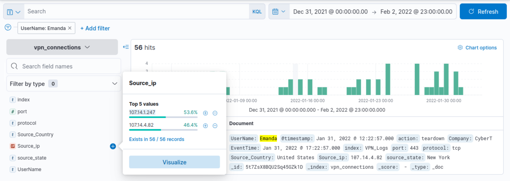

Answer
107.14.1.247

**On 11th Jan, which IP caused the spike observed in the time chart?**
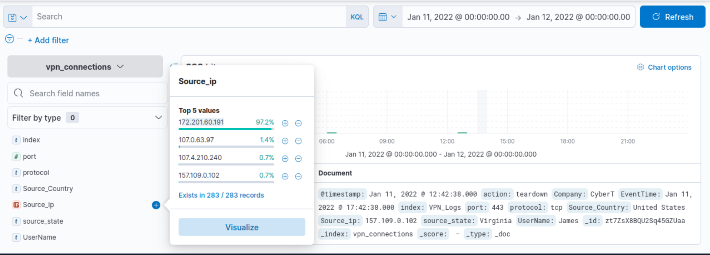

Answer
172.201.60.191

**How many connections were observed from IP 238.163.231.224, excluding the New York state?**
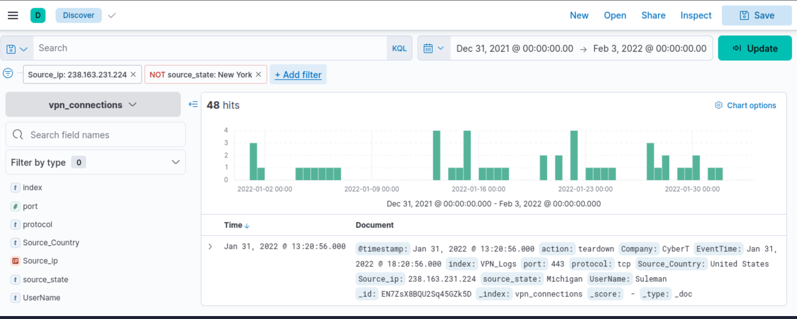

Answer
48 (filter `source_ip = 238.163.231.224` AND `source_state != New York`)

# Task 5: KQL Overview
KQL (Kibana Query Language) is what powers the search bar directly, instead of clicking through the Fields Pane one filter at a time.

**Create a search query to filter the logs where Source_Country is the United States and show logs from User James or Albert. How many records were returned?**
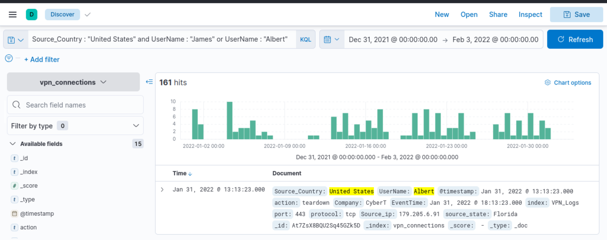Query: `Source_Country : "United States" and UserName : "James" or UserName : "Albert"`

Answer
161

**A user Johny Brown was terminated on the 1st of January, 2022. Create a search query to determine how many times a VPN connection was observed after his termination.**
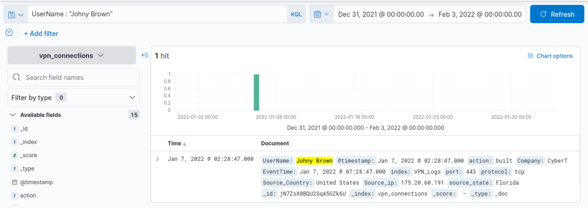

Answer
1

Worth flagging this one honestly, it's easy to get stuck on. Adjusting the time filter to "after Jan 1st" doesn't get you there cleanly, because the confirming detail isn't in the time filter, it's in the event itself. Filtering by `UserName: "Johny Brown"` directly returns a single event, and that event's own timestamp (Jan 7, 2022) is what confirms it happened after termination. The `action: built` field on that event is what indicates an actual VPN connection was established, not just an attempt. If you're stuck here, stop adjusting the time range and start reading the individual event's fields instead.

# Task 6: Creating Visualizations
Kibana visualizations live under Visualize Library, using **Lens** to drag and drop fields onto a chart type (bar, pie, table, etc.).

**Which user was observed with the greatest number of failed attempts?**
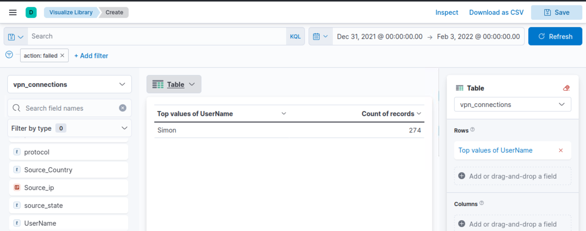Built by filtering `action: failed`, dragging `UserName` onto the visualization, and switching the display from bar chart to table for clearer reading.

Answer
Simon

**How many wrong VPN connection attempts were observed in January?**
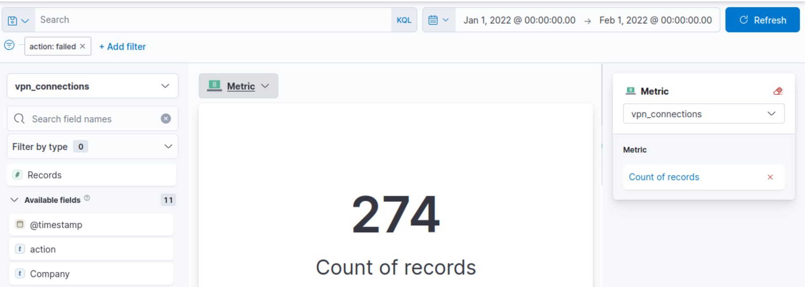Built the same way, time range set to January, `action: failed` filter applied, read off the Metrics count.

Answer
274

# Task 7: Creating Dashboards
No question, this task covers combining saved visualizations into a single dashboard view for a recurring investigation or reporting need.

# Detection / Defense Note

The IP-vs-state cross filter in Task 4 (`source_ip = X AND source_state != New York`) is a genuinely useful pattern beyond this room: isolating an IP's activity outside its expected geography is a fast way to spot account takeover or credential sharing, if a user's normal traffic clusters in one state and a chunk of connections from their IP show up elsewhere, that gap is worth investigating on its own.

# Lessons Learned

The Johny Brown question in Task 5 is the one worth internalizing as a general habit: when a time-range filter doesn't resolve a question cleanly, the answer is often sitting in a field on the event itself rather than in how the time window is sliced. Also, ELK and Splunk solve the identical underlying problem (search, filter, correlate large log volumes) with different syntax, KQL's `field: "value"` versus SPL's `field=value`, once the underlying SIEM concepts from the earlier rooms are solid, switching between tools is mostly a syntax problem, not a conceptual one.