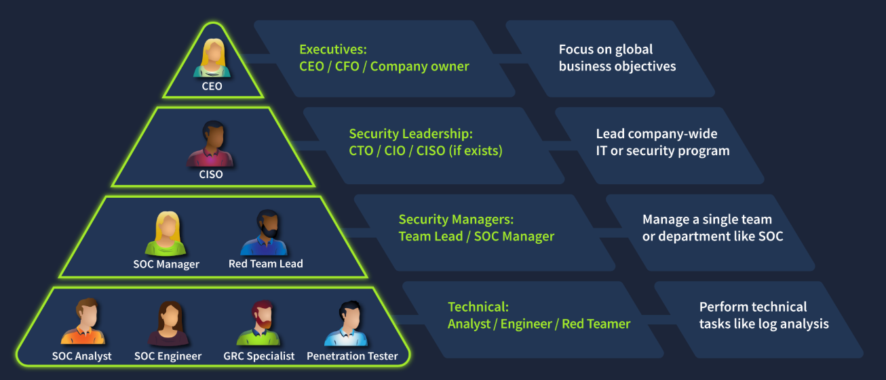
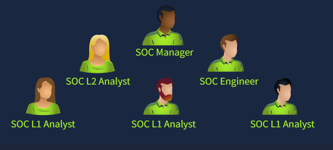
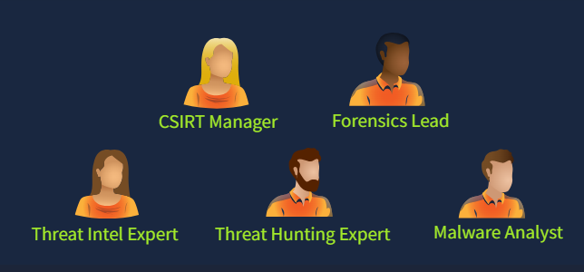
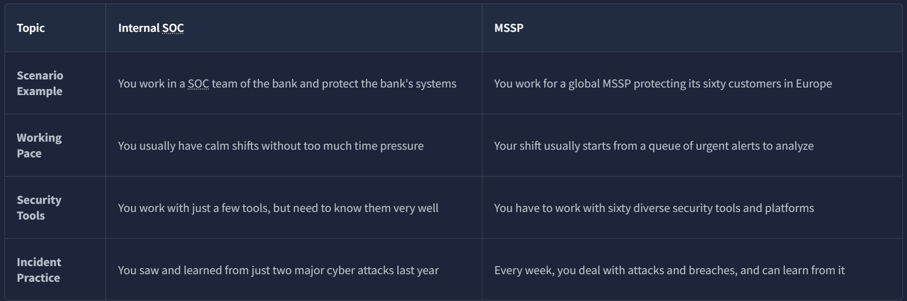
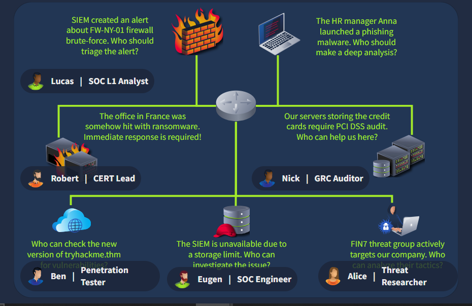

The first room told you what a SOC L1 analyst does. This one zooms out and shows where that role sits inside a whole company's security structure, who's above you, who's beside you, and where you go next.

# Task 1: Introduction

Learning Objectives:
-) Understand the concept and purpose of the Blue Team
-) Explore a place of the SOC within the company structure
-) Find out about your career path as a SOC L1 Analyst

Prerequisite:
[[1- Junior Security Analyst Intro]]

# Task 2: Security Hierarchy

Every company weighs risk differently depending on what it actually does. A law firm's top priority is document confidentiality, a factory cares most about uptime, a hospital cares most about patient safety. That's why security structures aren't one-size-fits-all.

A CEO runs the business globally and doesn't have the bandwidth to own technical security decisions, which is exactly why the CISO role exists, someone senior enough to make the calls but focused specifically on security. In small companies, one "IT department" absorbs this whole function. In bigger ones, it splits into three distinct teams:

- **Red Team** — offensive, pentesters and ethical hackers
- **Blue Team** — defensive, SOC analysts and engineers
- **GRC Team** — policy and compliance

**Which senior role typically makes key cyber security decisions?**

Answer

CISO

**What is the common name for roles like SOC analysts and engineers?**

Answer

Blue Team

# Task 3: Meet the Blue Team

The Blue Team constantly monitors for attacks and responds to them, ranging from 3 to 50 people depending on company size. Inside it, two groups do different jobs:

**SOC** runs 24/7: writes detection rules, investigates alerts, collects and monitors logs, works with IT, writes summary reports.

**CIRT** (sometimes nicknamed "the firefighters") gets called in on demand for the critical stuff: deep forensics, hidden threat hunting, and recovering systems that are actually breached, work the SOC on its own isn't built to handle.

Beyond those two, there are specialized defensive roles worth knowing: digital forensic analyst (disk/memory investigation), threat intelligence analyst (tracking emerging threat groups), AppSec engineer (secure development lifecycle), and increasingly, AI researcher (studying AI-specific threats).

**Does Blue Team focus on defensive or offensive security?**

Answer

Defensive

**Which department handles active or urgent cyber incidents?**

Answer

CIRT

# Task 4: Advancing SOC Career

Not every company runs its own SOC. A **Managed Security Services Provider (MSSP)** sells SOC-as-a-service to companies that don't want to build the team in-house. This matters for job hunting too, a real chunk of entry-level SOC roles on the market are MSSP seats, not internal ones, and the day-to-day can differ.

The natural next step after SOC L1 is SOC L2, which handles the deeper analysis that gets escalated up.

**How would you call a cyber security company providing SOC services?**

Answer

MSSP

**Which role naturally continues your SOC L1 analyst journey?**

Answer

SOC L2 Analyst

# Task 5: Final Challenge
This final task is a routing exercise: seven people, seven situations, match each to the right role.

| Person | Situation                                               | Role                               |
| ------ | ------------------------------------------------------- | ---------------------------------- |
| Lucas  | First to spot the alert                                 | Front-line triage (SOC L1)         |
| Robert | Senior enough to own the response                       | Escalation target for the incident |
| Ben    | Needs to vet a new software version for vulnerabilities | Red Team / ethical hacker          |
| Susan  | Deep analysis needed on a phishing malware sample       | SOC L2 Analyst                     |
| Nick   | Compliance check required                               | Auditor / GRC                      |
| Eugene | Storage limits need checking                            | Infrastructure / SOC Engineer      |
| Alice  | Needs current threat landscape info                     | Threat Intelligence                |

The pattern underneath all of it: match the _type_ of work to the team built for it. Vulnerability discovery goes to red team, not SOC. Compliance goes to GRC, not the analyst who spotted the alert. Deep malware analysis outranks a first responder's remit and belongs with L2.

Flag

THM{trysecureme_is_secured!}

# Lessons Learned

Knowing the org chart isn't trivia, it directly determines how fast an incident gets handled during a real one. A SOC that hasn't pre-defined who owns what will bottleneck under pressure, wasting time figuring out routing instead of acting on it.