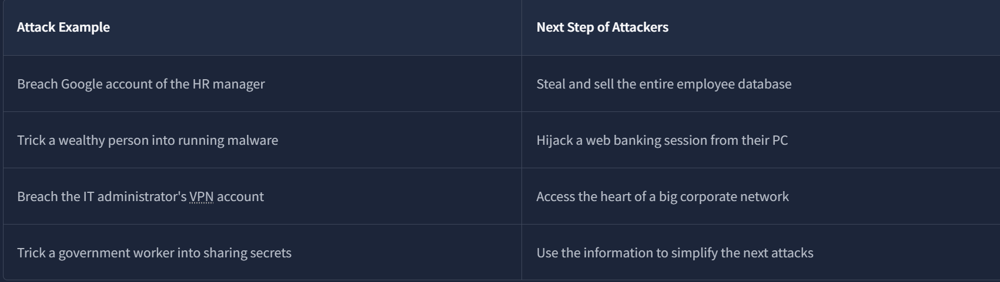
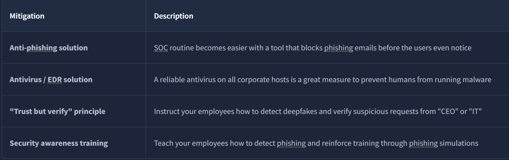
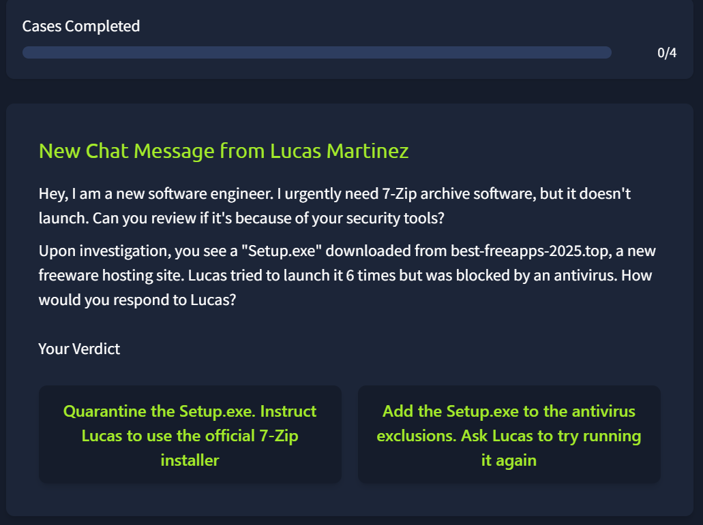
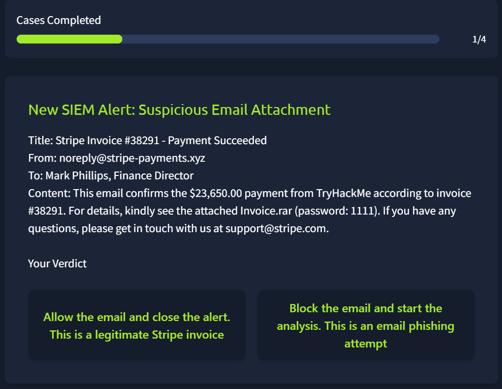
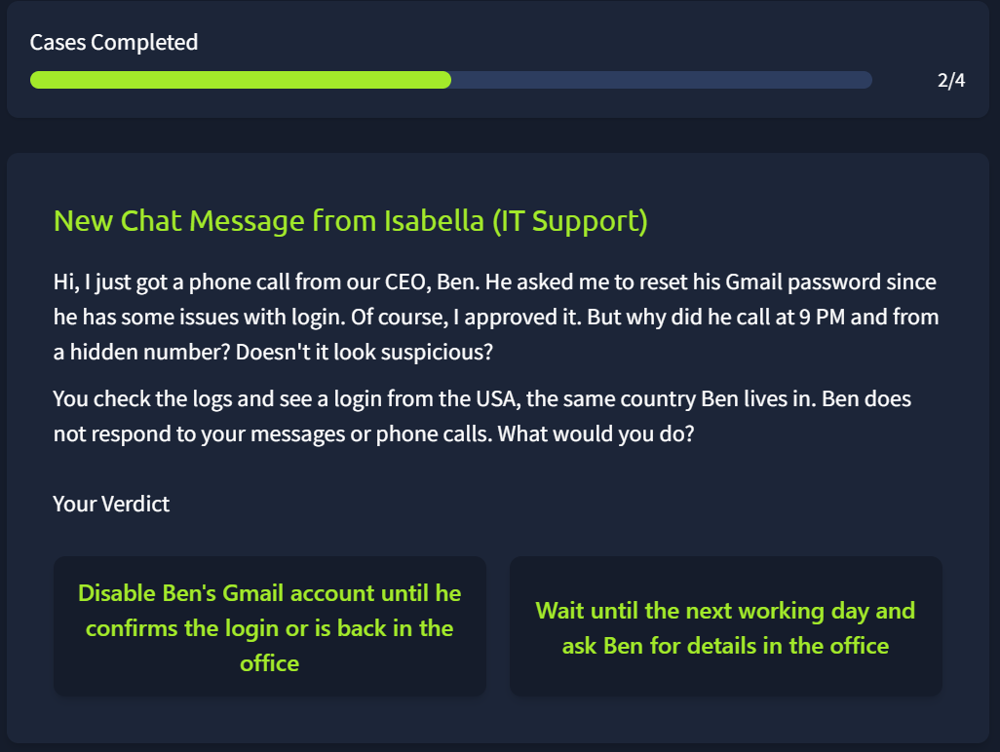
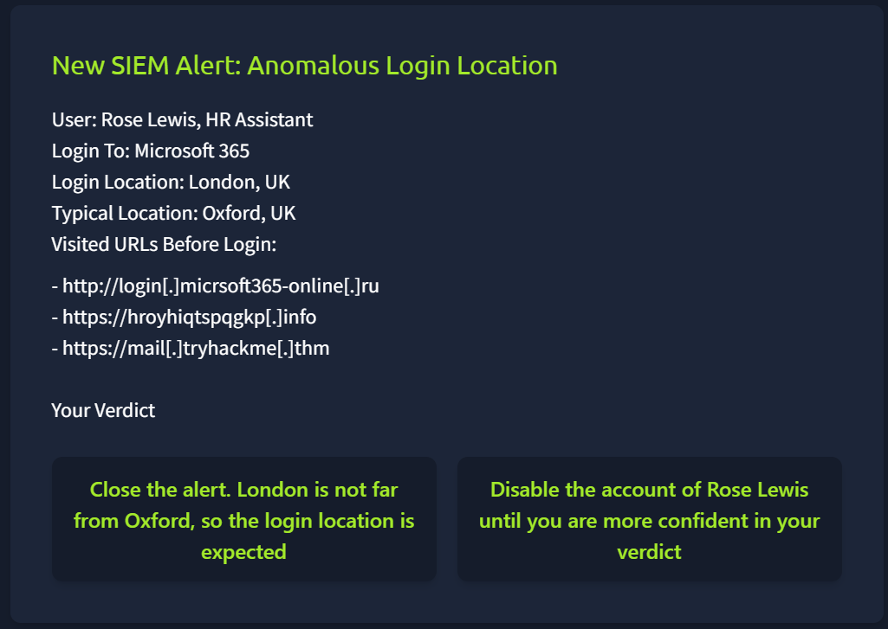
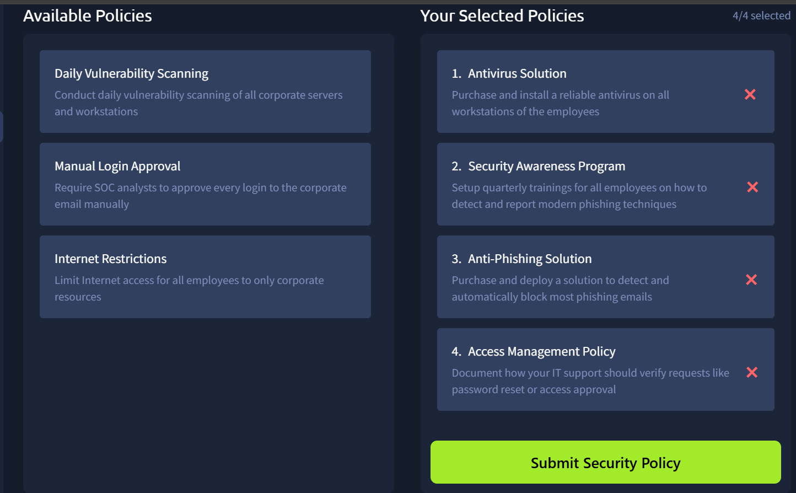

The SOC doesn't just protect servers, it protects people, because people are usually the easiest way in. This room walks through why humans get targeted and puts you through two realistic scenarios where you have to make a containment call.

# Task 1: Introduction
No question, just the room's framing: understand the human element, understand the SOC's role in defending it, then practice with two scenarios.

**Prerequisite:**
[[1- Junior Security Analyst Intro]]

# Task 2: The Human Element

Attackers don't always need to break cryptography or bypass a firewall. If they can manipulate a person into handing over access instead, that's usually faster and cheaper. That's the whole reason humans are considered the weakest link, not because people are careless, but because access through a person is often the path of least resistance.

Some examples:

**What or who is the weakest link in cyber security?**

Answer

Humans

**What do attackers seek when targeting humans in a cyberattack?**

Answer

access

# Task 3: Attacks on humans

**Social engineering** is manipulating a victim into helping the attacker, often without the victim ever realizing it. It covers phishing attacks, malware disguised as a legitimate download, and increasingly, deepfakes. When the attacker specifically pretends to be someone else to pull it off, that's the impersonation sub-type.

**What is the name of an attack tactic that manipulates human psychology?**

Answer

Social engineering

**Which social engineering method is about pretending to be someone else?**

Answer

Impersonation

# Task 4: Defending Humans

Two different jobs follow from this threat model, and it's worth keeping them separate in your head:

- **Mitigation** — reduce the odds or blast radius of an attack before it happens (training, access controls, awareness programs)
- **Detection** — catch what gets through anyway, which is where SOC skills come in

**Which process is aimed at preventing or reducing the chance of an attack?**

Answer

Mitigation

**Which mitigation measure is about training employees in cyber security?**

Answer

Security awareness training

# Task 5: Practice

### Employees at Risk

Four cases, each needs a containment decision based on what the indicators actually tell you.

**What flag did you receive after completing the "Employees at Risk" challenge?**

**Case 1 — Lucas downloads a game launcher from a free hosting site.** An unofficial source for something that should only come from the vendor is a red flag on its own, free hosting sites are a common malware distribution vector precisely because nothing there gets vetted. → Quarantine the file, redirect Lucas to the official launcher source.

**Case 2 — Suspicious email with a `.xyz` link and a `.rar` attachment.** `.xyz` is a TLD heavily associated with throwaway phishing infrastructure, and `.rar` is a common malware wrapper that dodges some scanners tuned for `.zip`. → Block the email, start analysis on the attachment before assuming anything.

**Case 3 — Odd-hours call from an unknown number, claiming to be Ben.** Unknown number plus an unusual time is exactly the profile of a deepfake voice call. → Disable Ben's account as a precaution until he's physically back and can confirm.

**Case 4 — Susan's browser history shows a fake login page.** Her last visited URLs point to a spoofed login, meaning her credentials are likely already compromised. → Disable her account immediately rather than waiting for confirmed misuse.

Flag

||THM{anyone_else_at_risk?}

### Security Policy

**What flag did you receive after completing the "Security Policy" challenge?**

The task asks you to weigh a set of proposed security measures, and not all of them earn their keep.

**Worth keeping:** antivirus, anti-phishing tooling, security awareness training, and access management. These meaningfully cut either the odds of a successful attack or the damage if one lands, without burning disproportionate resources.

**Not worth it:** daily vulnerability scanning (too resource-heavy for the marginal benefit at that frequency), fully manual login processes (automatable, and manual just wastes time without adding real security), and blanket internet restrictions (annoys employees more than it stops attackers, who don't need the employee's own browsing to get in).

The test that actually matters isn't "does this help," it's "does it help enough to justify what it costs." Daily scans and manual logins both fail that test even though they sound protective on paper.

Flag

||THM{human_protection_expert!}

## Detection Note

Cases 3 and 4 both hinge on the same principle: once identity can't be verified, or credential exposure is confirmed, disable first and investigate second. Waiting for confirmation before disabling an account that's already showing compromise indicators just extends the attacker's window. On the SOC side, a rule that flags "login immediately followed by navigation to a known-bad domain" (Case 4's actual signature) would catch this before an analyst even needs to check browser history manually.

## Lessons Learned

The right response depends on confidence level, not incident size. An unofficial download source is a "clean and re-educate" case, a confirmed credential-harvesting page is a "disable now" case, even though both start the same way: an employee clicked something they shouldn't have. Resource cost also matters as much as protective value when evaluating a control, since a technically protective measure that's too expensive to run in practice just gets ignored or bypassed anyway.
 